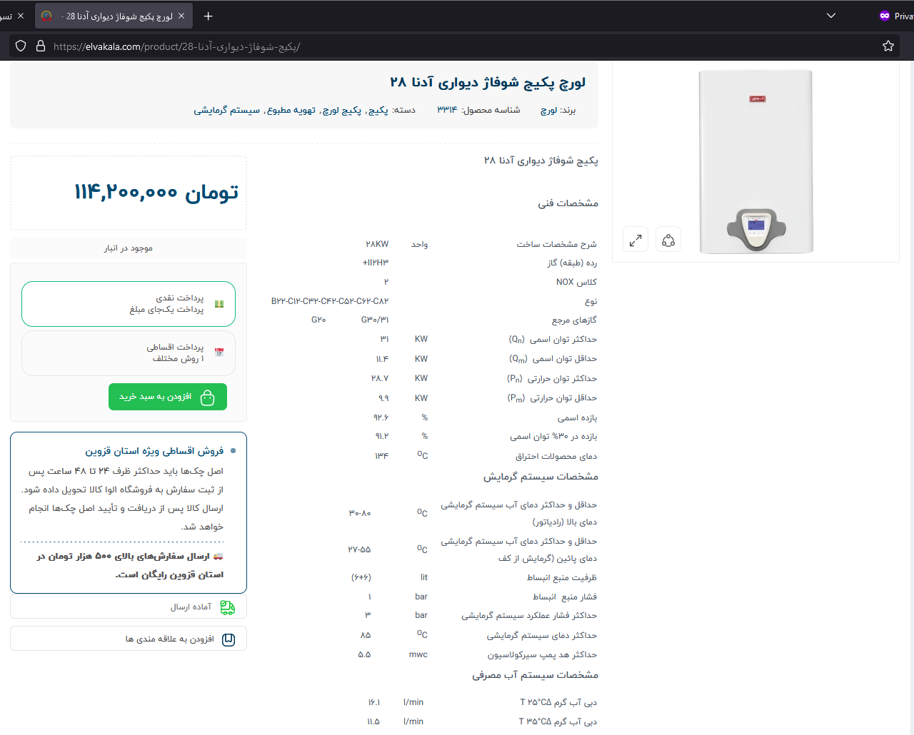
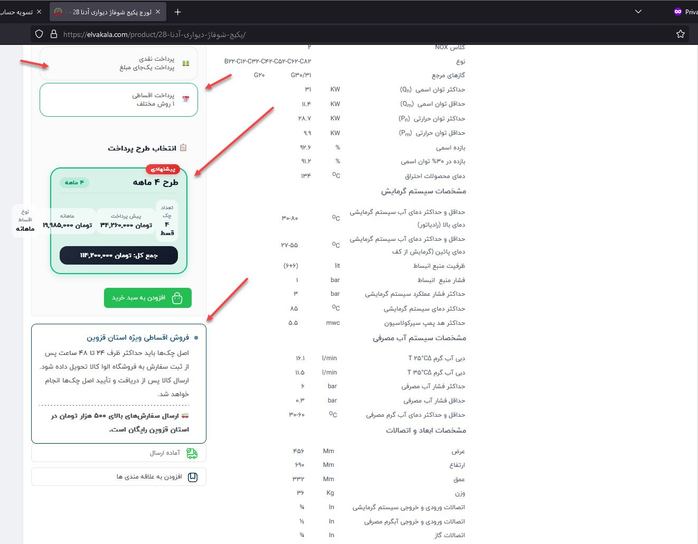
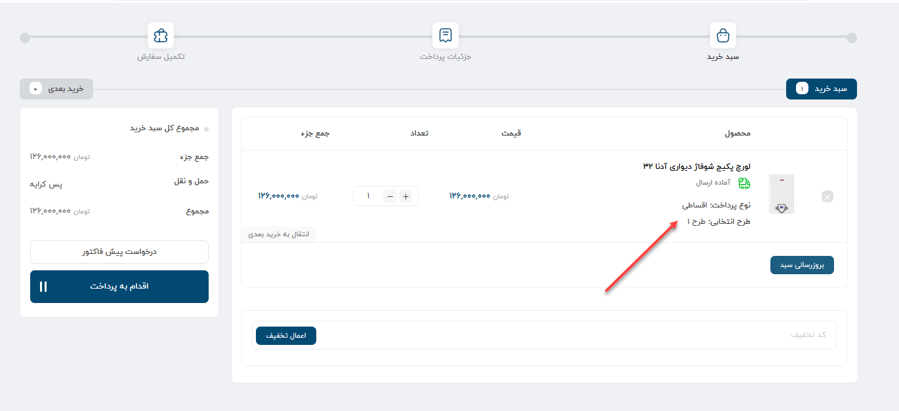
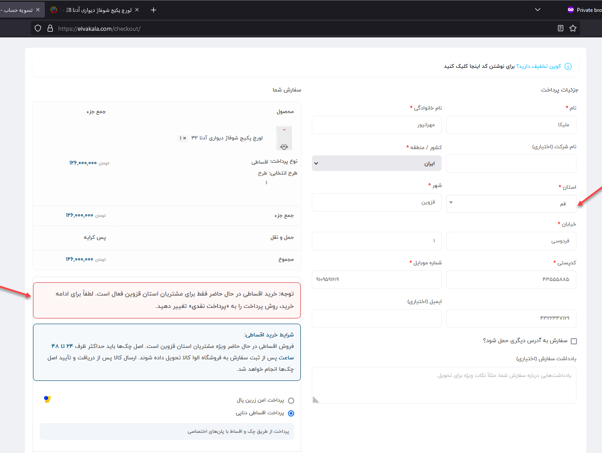
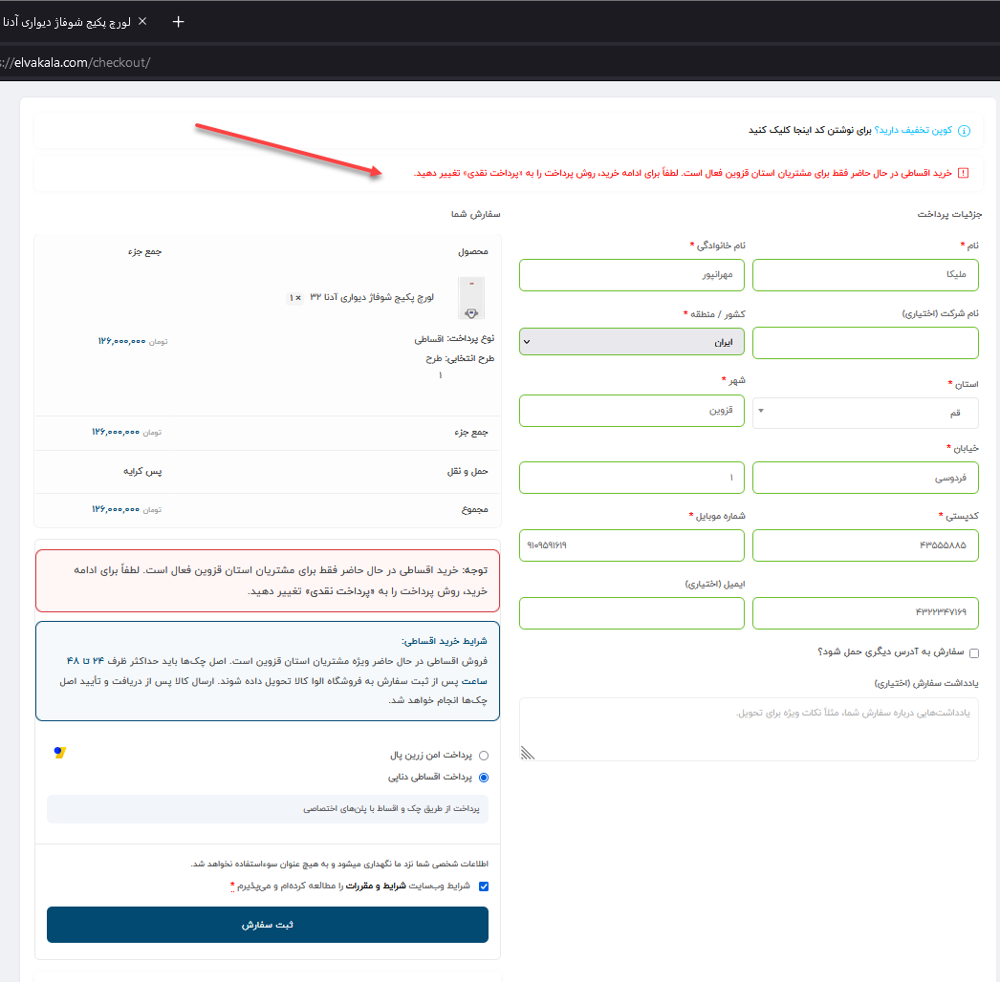

# ELVA KALA — DenaPay Plugin Customization

This directory contains the custom integration and behavior adjustments developed for the DenaPay installment payment plugin used on the ELVA KALA WooCommerce store.

The original plugin provides the installment payment functionality. The code documented here extends that functionality to match ELVA KALA's specific installment sales rules and checkout requirements.

The plugin's original source files are not modified or redistributed in this repository. The customization is implemented separately so that the additional business rules can be maintained independently from the third-party plugin.

---

## Purpose

ELVA KALA currently offers DenaPay installment purchases only to customers whose order is being shipped within Qazvin province.

Additional information also needs to be presented to customers during the purchase process so that the geographic restriction, installment conditions, shipping information, and check-delivery requirements are clear before the order is completed.

The customization therefore adds ELVA KALA-specific validation, pricing behavior, synchronization verification, and customer-facing notices around the existing DenaPay payment flow.

---

## Implementation

### `denapay-customization.php`

This file contains the custom PHP, JavaScript, and presentation logic used to extend the DenaPay installment checkout flow.

The implementation includes:

1. DenaPay installment sales are available only in Qazvin province.
2. Server-side validation prevents installment orders outside Qazvin province.
3. A live warning is displayed during Checkout when DenaPay is selected for an unsupported province.
4. Installment sales terms are displayed on product pages.
5. Free shipping information for eligible Qazvin orders is displayed with the installment terms.
6. The deadline for delivering the original checks is displayed on the deposit payment page.

---

## Qazvin Province Restriction

DenaPay installment purchases are restricted to Qazvin province.

The customization checks the customer's selected province during Checkout.

If the customer has enabled shipping to a different address, the shipping province is checked instead of relying only on the billing province.

This ensures that installment eligibility is based on the actual shipping destination.

---

## Server-Side Validation

The province restriction is enforced on the server side before the installment order can be completed.

This prevents the restriction from depending only on browser-side JavaScript or visible Checkout warnings.

When DenaPay is selected and the applicable province is outside Qazvin, the Checkout validation prevents the installment order from proceeding.

This provides the actual enforcement layer for the geographic sales restriction.

---

## Live Checkout Feedback

The customization also provides immediate feedback during Checkout.

The displayed information is updated when relevant Checkout data changes, including:

- Province
- Payment method
- Shipping address selection
- WooCommerce AJAX Checkout updates

When DenaPay is selected for a non-Qazvin destination, the customer receives a visible warning explaining that installment purchases are currently available only within Qazvin province.

The warning is removed or updated when the Checkout information becomes eligible.

---

## Product Page Installment Notice

Installment purchase information is displayed directly on product pages.

This allows customers to see the availability and important conditions of installment purchasing before reaching the cart or Checkout.

The notice communicates the relevant ELVA KALA installment sales terms and provides customers with information earlier in the purchasing process.

---

## Qazvin Shipping Information

The installment information also includes the applicable shipping information for Qazvin orders.

Eligible orders above the configured purchase threshold receive free shipping information directly alongside the installment sales conditions.

Keeping this information together reduces ambiguity between installment eligibility and delivery conditions.

---

## Original Check Delivery Deadline

The DenaPay purchase flow requires the original checks associated with the installment agreement to be delivered to the ELVA KALA store.

A dedicated notice is displayed on the deposit payment stage informing the customer about the required delivery deadline.

Customers are informed that the original checks must be delivered to the store within the specified 24–48 hour period.

This notice is intentionally shown during the payment flow so that the requirement remains visible after the installment order has been created.

---

# Screenshots

The screenshots in this directory document the DenaPay installment flow and the ELVA KALA-specific customization.

---

## Initial Payment Stage

### `00-order-pay-check-deadline.png`

Documents the order payment / deposit stage associated with the installment purchase flow and the check-delivery requirement.

This screenshot is kept as the initial reference for this part of the implementation.



---

## Product Installment Notice

### `01-product-installment-notice.png`

Shows the installment purchase information presented on the product page.

This allows customers to see the relevant installment conditions before proceeding further into the purchase flow.



---

## Installment Plan Details

### `02-installment-plan-details.png`

Documents the installment plan information presented as part of the DenaPay purchase process.



---

## Cart Installment Summary

### `03-cart-installment-summary.png`

Shows the installment-related information preserved and displayed in the WooCommerce cart.

This provides continuity between product selection and Checkout.


---

## Valid Qazvin Checkout

### `04-checkout-qazvin-valid.png`

Shows the Checkout state when the applicable order destination is within Qazvin province.

In this state, DenaPay installment purchasing is permitted and the customer can continue through the installment checkout flow.



---

## Non-Qazvin Checkout Warning

### `05-checkout-non-qazvin-warning.png`

Shows the warning displayed when DenaPay is selected while the applicable shipping destination is outside Qazvin province.

The interface informs the customer that installment purchases through this flow are currently restricted to Qazvin province.

Server-side validation provides the corresponding enforcement and prevents an ineligible installment order from being completed.



---

# Production Pricing and Synchronization Validation

## Removal of the Additional Installment Discount

The additional 10% discount previously applied to installment purchases was removed from the production DenaPay configuration.

Cash purchases may continue to use the applicable WooCommerce promotional or sale price, while installment calculations use the configured installment base price without the additional 10% installment discount.

This prevents an unintended second discount from being applied to installment orders.

---

## End-to-End Price Synchronization Test

A real product price change was performed by the ELVA KALA financial operator to verify the complete production synchronization path:

```text
Mahak → Bazara → WooCommerce → DenaPay
```

The test confirmed that:

- The updated product price was received from Mahak through Bazara.
- WooCommerce displayed the updated price correctly.
- The cash purchase price was recalculated correctly.
- DenaPay received the updated product information.
- The installment plan was recalculated using the correct installment base price.
- The removed 10% installment discount was not applied again.
- The product remained purchasable through both cash and installment methods.

---

## Production Verification

The final production flow was tested on both desktop and mobile devices.

The following scenarios passed:

- Product page display
- Cash payment selection
- Installment payment selection
- Installment plan calculation
- Cart display
- Checkout availability
- Mahak/Bazara price synchronization
- DenaPay recalculation after a real price update

No new related PHP error was recorded in `error_log` after the final synchronization test.

**Final status:** `Stable / Operational Pass`

---

## Private Integration Components

The production Listener and synchronization implementation contain private integration details and are intentionally excluded from this public repository.

This repository documents the integration behavior, business rules, validation process, and non-sensitive customization layer without publishing private synchronization code or third-party plugin source files.

---

# Technical Notes

This customization is intentionally maintained separately from the original DenaPay plugin.

The implementation depends on:

- WordPress
- WooCommerce
- DenaPay installment payment functionality
- WooCommerce Checkout hooks and validation
- WooCommerce AJAX Checkout updates
- Billing and shipping province values

The current ELVA KALA WooCommerce province code used for Qazvin is:

`GZN`

Because the customization interacts with DenaPay and WooCommerce behavior, compatibility should be reviewed after major updates to either plugin.

---

# Maintenance

When modifying this implementation, both client-side behavior and server-side validation should be preserved.

The live Checkout warning improves the customer experience, but it must not be treated as the only restriction mechanism.

Server-side validation is required to ensure that an installment order cannot bypass the Qazvin province restriction.

The original DenaPay plugin files should remain unmodified whenever possible. ELVA KALA-specific behavior should continue to be maintained separately in this customization layer.

After changes to product pricing, Bazara synchronization, WooCommerce pricing rules, or DenaPay calculations, the complete synchronization and checkout flow should be retested.

---

# Repository Scope

This directory contains only the ELVA KALA-specific customization developed around DenaPay.

It does not contain or redistribute the original DenaPay plugin.

Private Listener and synchronization components are excluded from the repository.

Other independent WordPress and WooCommerce modifications are maintained under the repository's `snippets` section, while customizations created specifically for third-party plugins are maintained under `Plugin-Customizations`.
