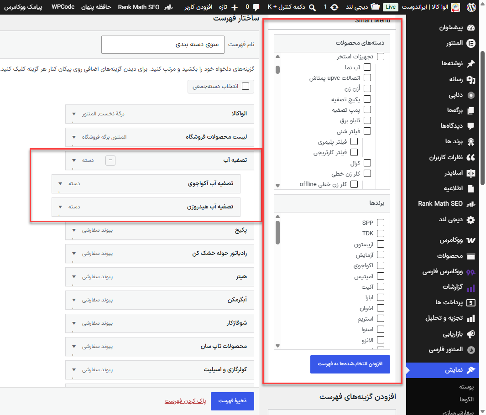

# Smart Menu Hierarchy — Prototype

A custom WordPress/WooCommerce menu-management enhancement developed during the **Elvakala Website** project.

The prototype was created to simplify the management of large WooCommerce navigation menus with deeply nested product categories and brands.

> **Note:** This repository contains only a limited sample of the implementation.
> The complete Smart Menu Hierarchy source code is maintained separately.

## Problem

Managing large navigation menus with WordPress's native drag-and-drop interface can become difficult when a WooCommerce store contains many product categories, subcategories, and brands.

Some of the main issues addressed by this prototype were:

* Manually creating menu links for WooCommerce categories
* Repeatedly copying category URLs into Custom Links
* Maintaining parent/child relationships manually
* Moving large nested branches inside long menus
* Managing deeply nested menu structures
* Navigating large expanded menu trees in the WordPress admin

## Implemented Prototype

The Smart Menu Hierarchy prototype extends the native:

**Appearance → Menus**

interface instead of replacing WordPress navigation menus with a separate menu system.

Current prototype functionality includes:

* WooCommerce Product Categories (`product_cat`)
* WooCommerce Product Brands (`product_brand`)
* Hierarchical taxonomy detection
* Tree-based category and brand selection
* Checkbox-based menu item selection
* Native WordPress menu-item creation
* Automatic preservation of taxonomy hierarchy
* Parent/child menu placement
* Support for adding new children to existing menu parents
* Prevention of duplicate taxonomy menu items
* Collapsible menu branches in the WordPress admin
* Compatibility with native WordPress menu drag-and-drop behavior

## Smart Hierarchy

Selected WooCommerce terms retain their logical hierarchy when added to a WordPress menu.

For example:

```text
Water Pumps
├── Domestic Water Pumps
├── Industrial Water Pumps
└── Booster Pumps
```

When related terms are selected, the prototype can construct the corresponding parent/child menu structure automatically instead of requiring every item to be positioned manually.

If an appropriate ancestor already exists in the menu, newly added descendants can be associated with that existing menu branch.

## Collapsible Branches

Large menu branches can be collapsed inside the WordPress administration interface.

```text
[-] Water Pumps
    Domestic Water Pumps
    Industrial Water Pumps
    Booster Pumps
```

becomes:

```text
[+] Water Pumps
```

This affects only the menu-management interface and does not modify the frontend navigation output.

## Screenshot



The screenshot shows the prototype integrated directly into the native WordPress menu editor:

* **Smart Menu panel:** WooCommerce product categories and brands
* **Menu structure:** automatically nested taxonomy items
* **Collapse control:** branch-management enhancement for large menus

## Sample Code

`smart-menu-hierarchy-sample.php` contains a limited implementation sample demonstrating:

* WooCommerce taxonomy discovery
* Retrieval of taxonomy terms
* Parent/child term data
* Hierarchical tree rendering
* Integration with the WordPress menu-management screen

Core product logic is intentionally maintained separately from this project repository.

## Status

**Prototype / Experimental**

Developed and tested as part of the Elvakala website menu-management workflow.

The implementation may later be developed into an independent WordPress plugin.
