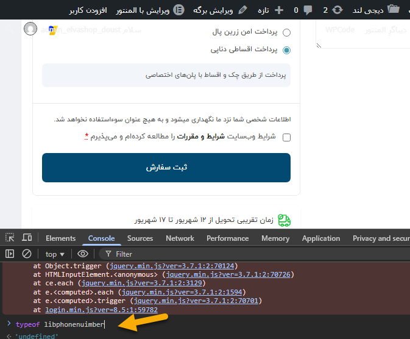

# ELVA Digits Customizations

Custom fixes and improvements for the Digits plugin used in ELVAKALA website.

This package contains custom modifications that extend and improve the behavior of the Digits plugin without modifying the original plugin files.

---

# 1. Digits libphonenumber Loading Fix

## Problem

During WooCommerce checkout testing, the order submission process became unstable.

Symptoms:

- Checkout JavaScript errors appeared in the browser console.
- The order submission button sometimes did not respond.
- The issue was initially suspected to be related to payment customization, but further investigation showed that the problem was caused by the Digits plugin dependency loading.

The main browser console error was:

```text
ReferenceError: libphonenumber is not defined
```

The error originated from Digits JavaScript files:

```text
/wp-content/plugins/digits/assets/js/main.min.js
/wp-content/plugins/digits/assets/js/login.min.js
```

Digits requires the `libphonenumber` library for phone number processing.

The library was loaded from an external CDN:

```text
https://unpkg.com/libphonenumber-js@latest/bundle/libphonenumber-max.js
```

During testing, the external CDN request was unstable and the library was not loaded correctly.

As a result:

- The global `libphonenumber` object was unavailable.
- Digits JavaScript execution failed.
- Checkout behavior became unreliable.

---

## Investigation

The issue was investigated through browser developer tools and checkout testing.

Steps performed:

1. Checked browser console errors.
2. Verified the source of the JavaScript error.
3. Confirmed that the issue was generated by Digits scripts.
4. Tested the availability of the required library.

Before fix:

```javascript
typeof libphonenumber
```

Result:

```text
undefined
```

The external CDN resource was tested and showed connection instability.

---

## Solution

The external CDN dependency was replaced with a locally hosted version.

Changes:

- Added local `libphonenumber-max.js`
- Updated Digits customization to load the local library
- Removed dependency on external CDN availability
- Kept Digits core plugin files unchanged

Project structure:

```text
elva-digits-customizations/

├── elva-digits-customizations.php
├── libphonenumber-max.js
└── screenshots/
```

---

## Verification

After applying the fix:

Test:

```javascript
typeof libphonenumber
```

Result:

```text
object
```

Confirmed:

- Digits JavaScript loaded correctly
- Checkout errors were resolved
- Order submission worked correctly
- DenaPay installment payment flow was successfully tested

---

## Screenshots

### Before Fix

Digits JavaScript error:



### After Fix

Library loaded successfully:


---

# 2. Installment Checkout Discount Rules

## Problem

For products with discounts, customers could see discounted prices while selecting installment payment.

This could create confusion because installment purchases should follow different discount rules.

The expected behavior:

- Normal payment → product discount applies
- Installment/check payment → discount should not be applied

---

## Solution

Installment checkout rules were added to clearly communicate the payment condition.

A new customer-facing message was added:

```text
در صورت خرید چکی، تخفیف اعمال نمی‌شود.
```

Meaning:

This message informs customers that discounts are not applied when choosing installment/check payment.

Before this change, customers could see discounted prices during installment checkout, which could create confusion about whether the discount was included in the installment purchase.

The checkout flow was tested to ensure:

- Cart price calculation is correct.
- Checkout summary is correct.
- Installment payment flow works correctly.
- Customer receives clear information before payment.

---

## Installment Checkout Tests

### Cart Rule Display


### Discount Rule Applied


### Checkout Price Calculation


### DenaPay Payment Flow


---

# Final Result

The Digits dependency loading issue was resolved by replacing the unstable external library source with a local version.

The installment checkout flow was verified and the discount rules were clearly communicated to customers.

All changes were implemented as a customization layer without modifying third-party plugin core files.
