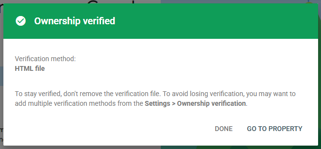
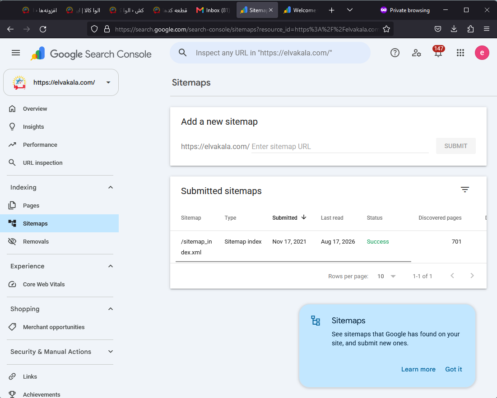
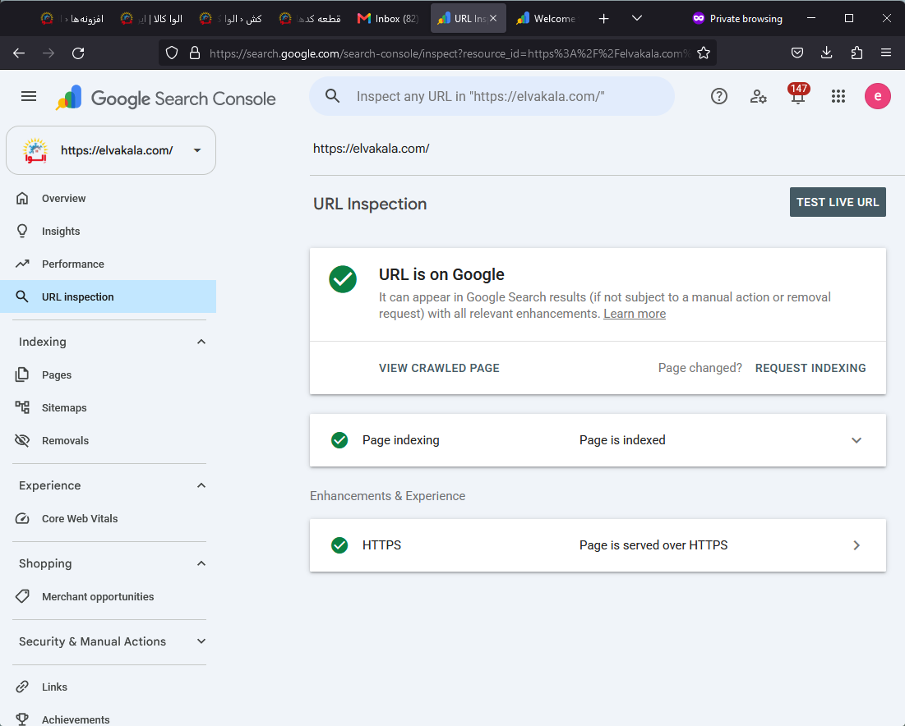
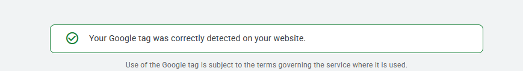
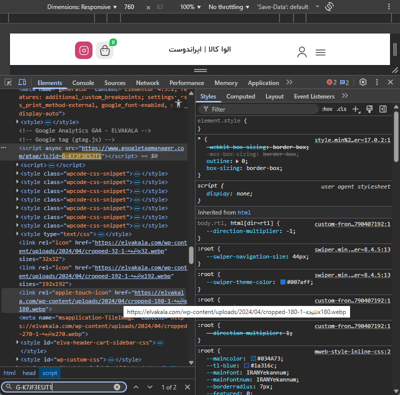
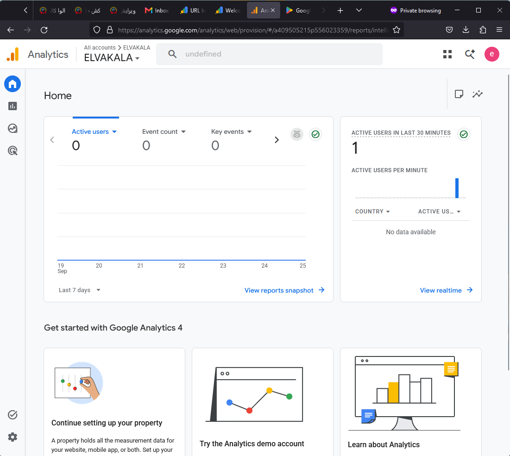

# ELVAKALA — Google Analytics & Search Console

This directory documents the setup and verification of Google Search Console and Google Analytics 4 (GA4) for the ELVAKALA e-commerce website.

## Google Search Console

Google Search Console was configured to monitor search visibility, indexing status, sitemap discovery, and crawlability.

### Ownership Verification

The website ownership was successfully verified using the HTML file verification method.

### XML Sitemap

The existing XML sitemap was successfully detected and processed by Google Search Console.

- Sitemap: `sitemap_index.xml`
- Status: **Success**
- Discovered pages at verification time: **701**

### URL Indexing

The homepage was inspected through Google Search Console and confirmed as:

- Available on Google
- Successfully indexed
- Crawl allowed
- Indexing allowed
- Served over HTTPS
- Successfully fetched by Googlebot

---

## Google Analytics 4

A new Google Analytics 4 property and Web Data Stream were configured for ELVAKALA.

### GA4 Configuration

- Platform: Web
- Stream name: `ELVAKALA Website`
- Website: `https://elvakala.com`
- Enhanced Measurement: Enabled

Enhanced Measurement provides automatic tracking for interactions including:

- Page views
- Scrolls
- Outbound clicks
- Site search
- Video engagement
- File downloads
- Form interactions

### Google Tag Installation

The Google tag was deployed site-wide through WPCode and inserted into the website `<head>`.

The installation was successfully detected and verified by Google Analytics.

The tag placement was also verified directly in the rendered page `<head>` using browser developer tools.

### Realtime Data Verification

After deployment, GA4 successfully began receiving live website traffic.

The Realtime report confirmed an active user within the first setup session, verifying that the complete data collection pipeline was operational.

---

## Final Status

| Component | Status |
|---|---|
| Search Console ownership | ✅ Verified |
| XML sitemap | ✅ Successfully detected |
| Homepage indexing | ✅ Indexed |
| HTTPS | ✅ Valid |
| GA4 property | ✅ Configured |
| Web data stream | ✅ Configured |
| Enhanced Measurement | ✅ Enabled |
| Google tag | ✅ Installed |
| Google tag detection | ✅ Verified |
| Realtime data collection | ✅ Working |

## Result

ELVAKALA is now connected to Google's search monitoring and web analytics infrastructure, enabling ongoing monitoring of:

- Organic search visibility and indexing
- Website traffic and acquisition channels
- User behavior and engagement
- Page performance and content interaction
- Realtime website activity
