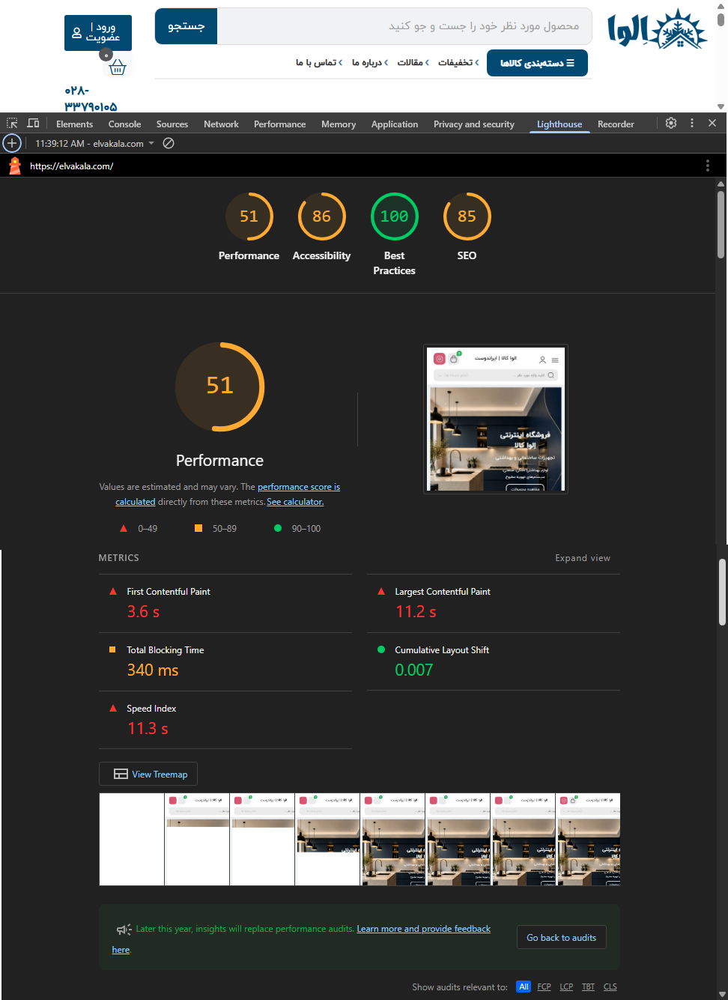
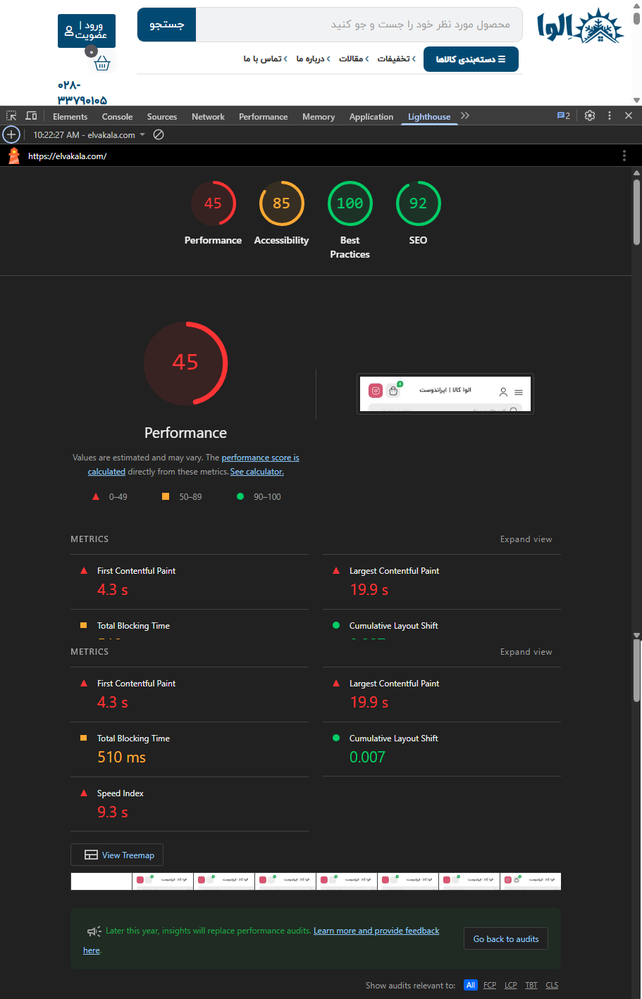
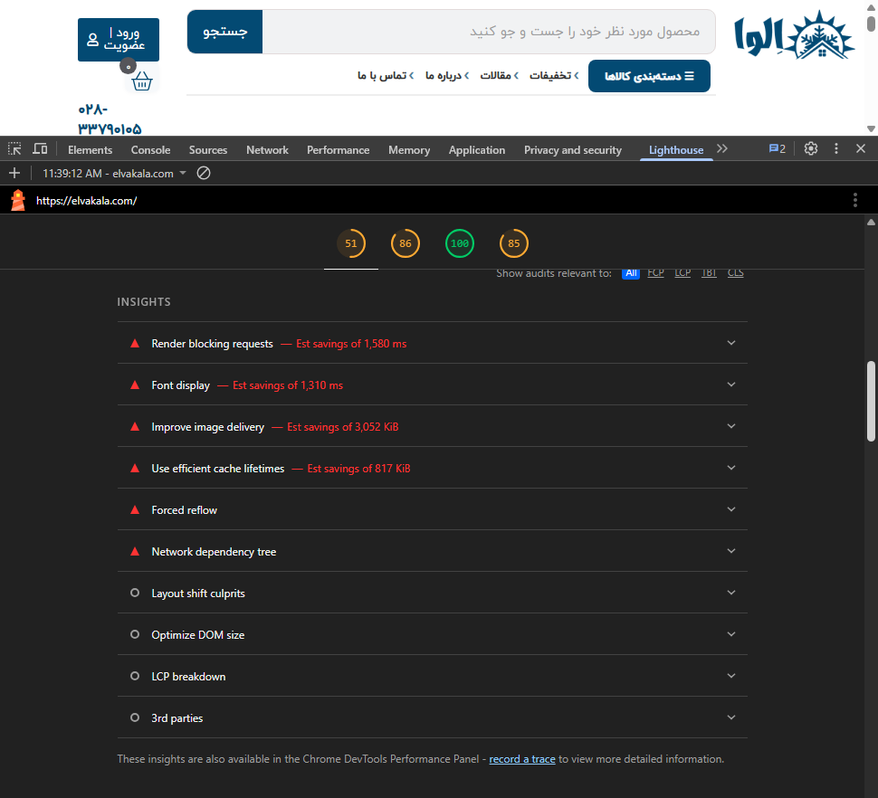
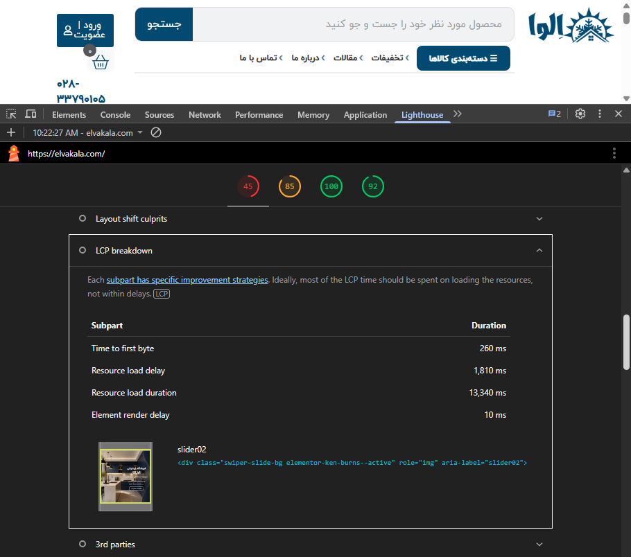
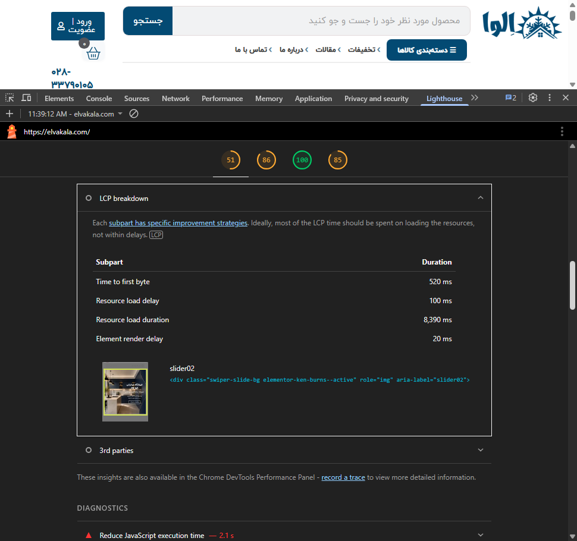
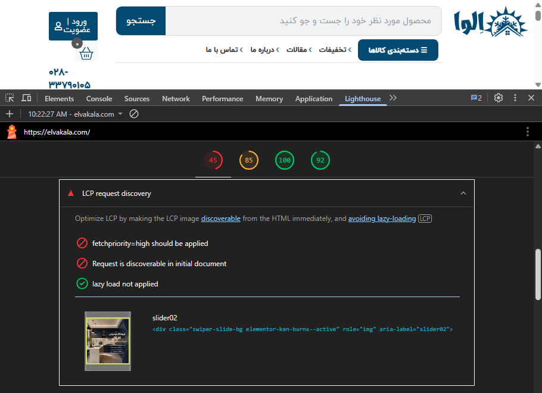

# LCP Optimization – Responsive Hero Slider Preload

This directory documents the investigation and optimization of the Largest Contentful Paint (LCP) element on the ElvaKala homepage.

The main LCP element was identified as the homepage hero slider (`slider02`). The investigation showed that desktop and mobile layouts use different image assets, which required separate preload rules based on viewport width.

---

## 1. Initial Lighthouse Results

Initial mobile Lighthouse tests showed unstable and relatively high LCP values.

One test produced:

- Performance: 51
- First Contentful Paint (FCP): 3.6 s
- Largest Contentful Paint (LCP): 11.2 s
- Total Blocking Time (TBT): 340 ms
- Cumulative Layout Shift (CLS): 0.007
- Speed Index: 11.3 s



Another Lighthouse run showed an even higher LCP:

- Performance: 45
- First Contentful Paint (FCP): 4.3 s
- Largest Contentful Paint (LCP): 19.9 s
- Total Blocking Time (TBT): 510 ms
- Cumulative Layout Shift (CLS): 0.007
- Speed Index: 9.3 s



These results also demonstrate the variability between Lighthouse runs, so the investigation focused on the underlying LCP loading behavior rather than relying only on the overall Performance score.

---

## 2. Lighthouse Insights Before Optimization

The Lighthouse report identified several performance issues, including:

- Render-blocking requests
- Font display delays
- Inefficient image delivery
- Cache lifetime issues
- Forced reflow
- Network dependency chains



The LCP breakdown identified `slider02` as the Largest Contentful Paint element.

In one of the slower runs, the LCP timing included:

- Time to First Byte: 260 ms
- Resource Load Delay: 1,810 ms
- Resource Load Duration: 13,340 ms
- Element Render Delay: 10 ms



---

## 3. LCP Resource Investigation

Further testing continued to identify the homepage hero slider as the LCP element.

A later LCP breakdown showed:

- Time to First Byte: 520 ms
- Resource Load Delay: 100 ms
- Resource Load Duration: 8,390 ms
- Element Render Delay: 20 ms



However, Lighthouse's **LCP request discovery** audit showed two important problems:

- `fetchpriority=high` was not applied to the LCP resource
- The LCP image request was not discoverable directly from the initial document

Lazy loading was not being applied to the LCP image, which was correct.



This indicated that improving early discovery and request priority of the hero image could reduce unnecessary LCP resource delay.

---

## 4. Desktop Slider Preload

The desktop hero image was added to the initial HTML as a preload resource with high fetch priority.


This ensured that the browser could discover the desktop LCP image earlier instead of waiting for the slider implementation to expose the resource.

---

## 5. Identifying the Mobile Slider Asset

Network inspection at a mobile viewport confirmed that the mobile version of the homepage slider loads a separate image:

`slider02-900x480-1.png`


Because the desktop and mobile versions use different image files, preloading only the desktop image would not correctly optimize the mobile LCP request.

---

## 6. Responsive LCP Preload

Separate preload rules were therefore added for desktop and mobile viewports.

```html
<link
  rel="preload"
  as="image"
  href="/wp-content/uploads/2026/08/slider02-900x480-1.png"
  media="(max-width: 767px)"
  fetchpriority="high"
>

<link
  rel="preload"
  as="image"
  href="/wp-content/uploads/2026/07/slider02.png"
  media="(min-width: 768px)"
  fetchpriority="high"
>
```

The resulting HTML confirms that both responsive preload declarations are present in the initial document.


---

## Result

The investigation established that the homepage hero slider is the primary LCP element and that desktop and mobile layouts use different image resources.

The optimization therefore focuses on:

- Identifying the actual LCP element
- Inspecting the LCP request discovery path
- Avoiding lazy loading for the LCP image
- Applying `fetchpriority="high"`
- Preloading the LCP resource from the initial HTML
- Using viewport-specific preload rules
- Preloading the correct mobile and desktop slider assets separately

This change improves the browser's ability to discover and prioritize the correct hero image as early as possible.

Lighthouse performance values can vary significantly between runs and are also affected by image transfer time, server response time, render-blocking resources, fonts, JavaScript execution, and other page resources. Therefore, the responsive preload implementation is documented here as one part of the broader ElvaKala performance optimization work rather than as a complete LCP solution.
