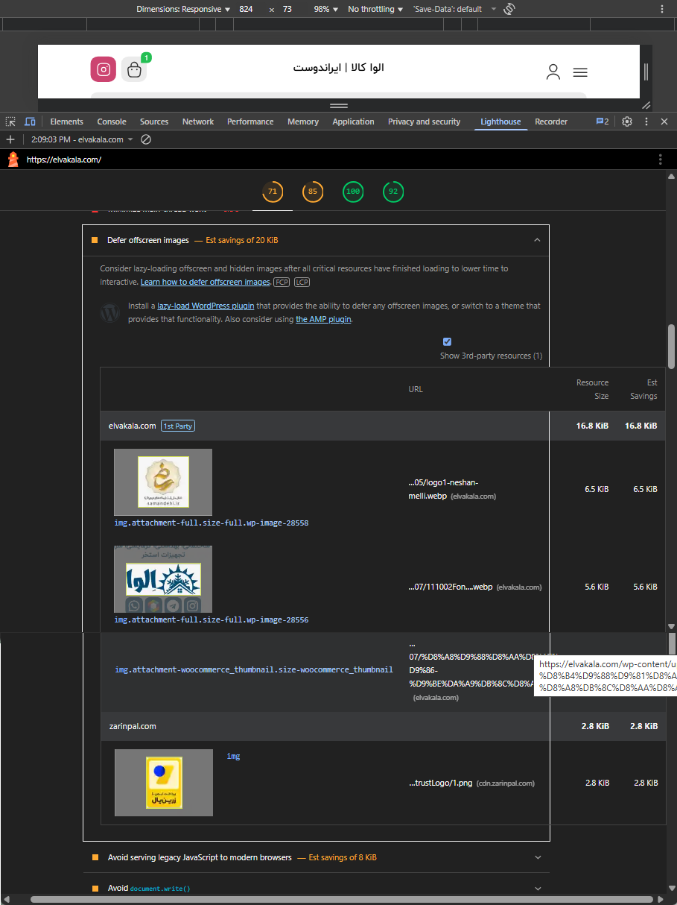
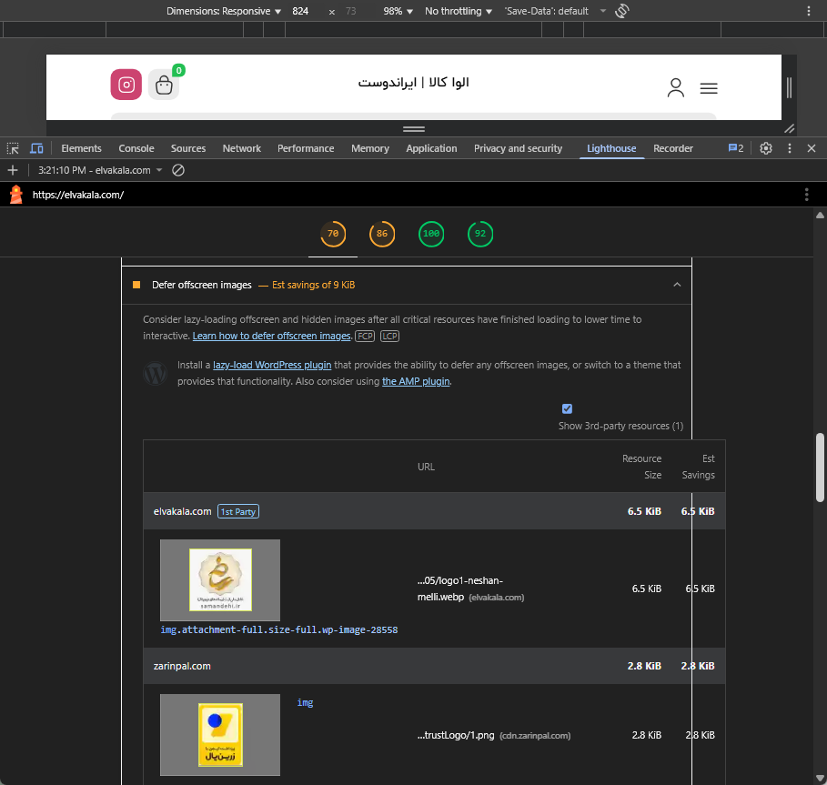
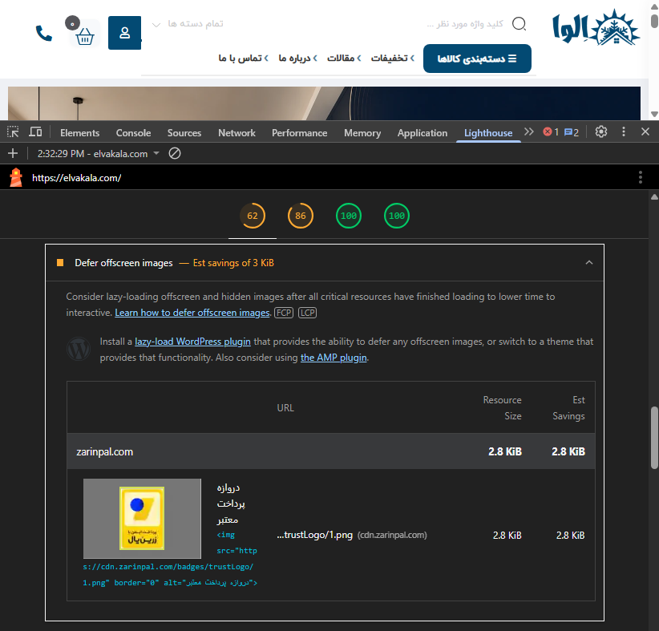

# ELVA Offscreen Image Optimization

This directory documents the targeted optimization of non-critical offscreen images on the ELVA KALA website.

The goal was to reduce unnecessary image loading during the initial page render by applying native lazy loading only to selected images located outside the initial viewport.

## Initial Lighthouse Audit

The initial Lighthouse **Defer offscreen images** audit reported approximately:

```text
20 KiB estimated savings
```

The report identified several offscreen images, including ELVA-controlled footer images and third-party resources.

<p align="center">
  
</p>

## Optimization

Two non-critical WordPress images controlled by ELVA KALA were selected for optimization:

* Attachment ID `28556` — ELVA KALA footer logo
* Attachment ID `28558` — National Standard Organization logo

The following attributes are applied to these images:

```html
loading="lazy"
decoding="async"
fetchpriority="low"
```

Existing conflicting `loading`, `decoding`, and `fetchpriority` attributes are removed before the optimized attributes are applied.

The optimization is intentionally restricted to known offscreen images instead of globally modifying WordPress image-loading behavior.

## Implementation

The optimization is implemented through the following WordPress snippet:

```text
/snippets/performance/lazy-load-footer-images.php
```

This allows the optimization to be enabled, modified, or rolled back without editing WordPress, Elementor, or theme core files.

## Lighthouse Results

### Before Optimization

The initial Lighthouse audit reported approximately:

```text
20 KiB estimated savings
```

### After Targeted Optimization

After applying lazy loading to the selected ELVA-controlled footer images, the remaining opportunity was reduced to approximately:

```text
9 KiB estimated savings
```

<p align="center">
  
</p>

### Current Validation

A later Lighthouse validation reduced the remaining opportunity to approximately:

```text
3 KiB estimated savings
```

The only resource still reported was a third-party ZarinPal trust-logo image served from:

```text
cdn.zarinpal.com
```

<p align="center">
  
</p>

## Result

The Lighthouse **Defer offscreen images** opportunity was reduced from approximately:

```text
20 KiB → 9 KiB → 3 KiB
```

The remaining resource is externally hosted and outside the direct scope of the ELVA-controlled WordPress attachment optimization.

Applying aggressive global lazy-loading changes for an additional saving of approximately 3 KiB would provide limited benefit and could introduce unnecessary risk to critical images and LCP behavior.

## Validation

The following checks passed after implementation:

* Footer images still render correctly
* Optimized images load when approaching the viewport
* Critical above-the-fold images remain unaffected
* Homepage LCP assets remain unchanged
* Footer layout remains unchanged
* No global WordPress image-loading behavior is modified
* Desktop presentation remains functional
* Responsive presentation remains functional

## Scope

This implementation affects only the explicitly selected WordPress attachment IDs.

It does not globally modify:

* Product images
* Hero slider images
* Category images
* Above-the-fold images
* Elementor image widgets
* Third-party image resources
* Default WordPress lazy-loading behavior

## Rollback

To roll back the optimization:

1. Open the WPCode snippet manager.

2. Deactivate the snippet associated with:

   ```text
   lazy-load-footer-images.php
   ```

3. Clear WordPress, server, CDN, and browser caches.

4. Reload the affected pages and verify the footer images.

No original theme, plugin, Elementor, media-library, or image files were modified.

## Status

```text
Production: Active
Initial opportunity: Approximately 20 KiB
After targeted optimization: Approximately 9 KiB
Current remaining opportunity: Approximately 3 KiB
Remaining resource: Third-party ZarinPal trust logo
Desktop validation: PASS
Responsive validation: PASS
Rollback available: Yes
```
