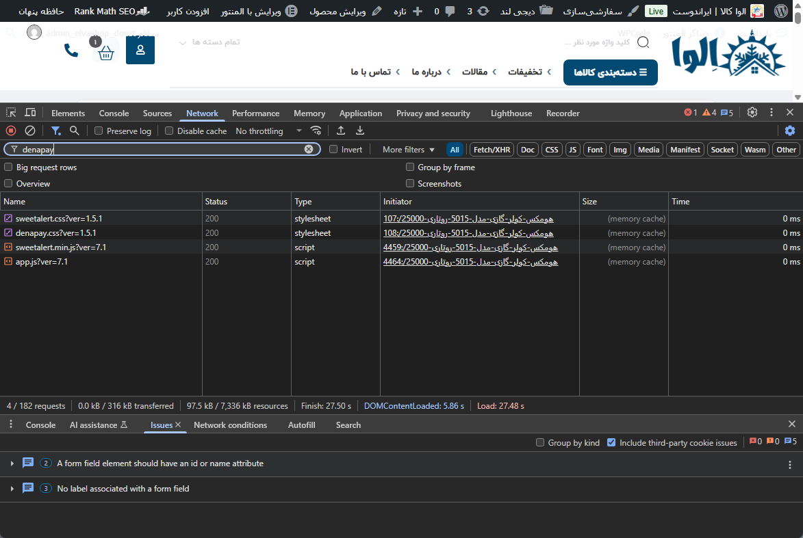
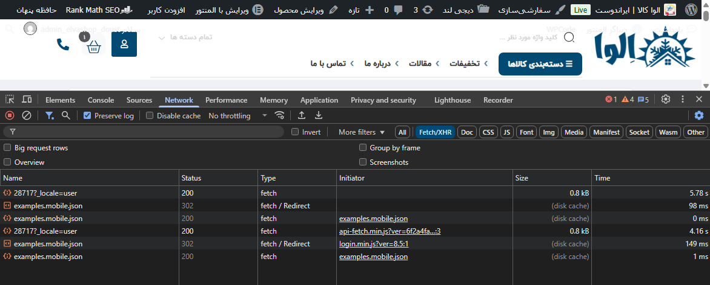
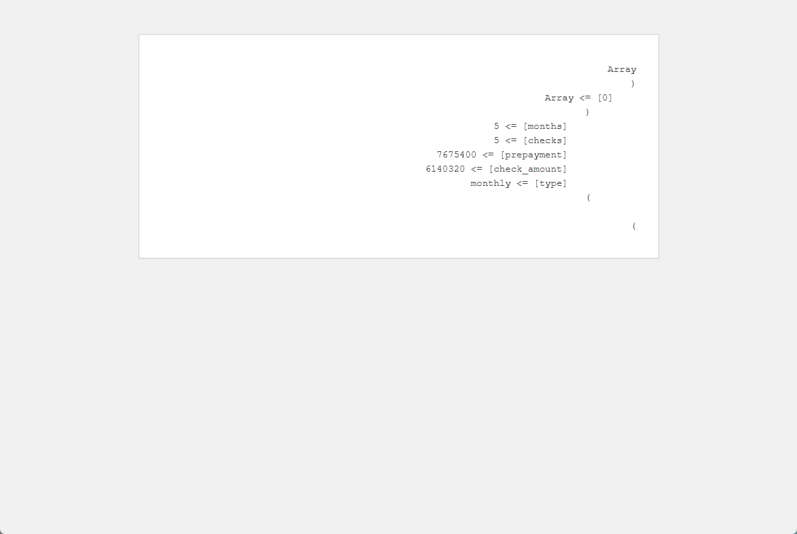
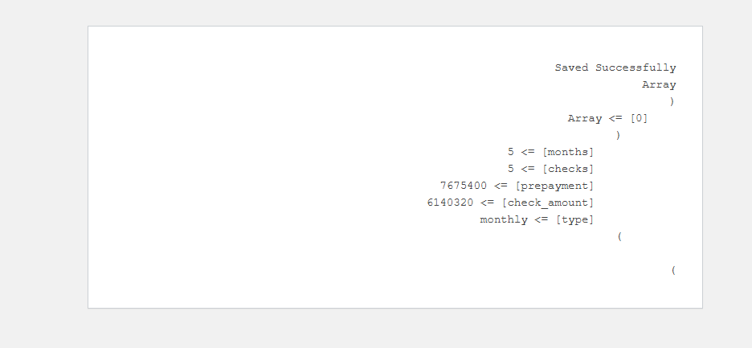
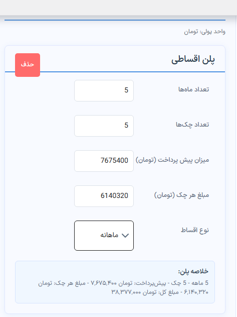
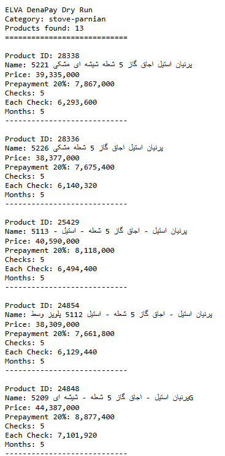

# ELVA Installment Manager --- Architecture Decisions

This document records important architectural decisions made during the
development of the ELVA Installment Manager plugin.

The purpose of this document is to preserve the reasoning behind
technical decisions and explain why the final architecture was selected.

------------------------------------------------------------------------

# Decision 001 --- Product-Level Installment Rules

## Background

During the investigation of DenaPay installment functionality, we
identified that installment plans can be configured at product level.

DenaPay allows creating custom installment settings directly for
individual WooCommerce products.

Example:

Product A:

-   30% initial payment
-   5 checks

Product B:

-   20% initial payment
-   4 checks

This capability provides the flexibility required by ELVAKALA business
rules.

------------------------------------------------------------------------

# Initial Business Requirement

The business requirement was not only based on individual products.

Installment conditions depend on product groups, categories, and
business rules.

Examples:

``` text
Brand: Parnian
Category: Gas Cookers

Rule:
30% prepayment
5 checks
```

``` text
Brand: Bimax
Category: Gas Cookers

Rule:
20% prepayment
4 checks
```

Different product groups may require different installment conditions.

The problem was that applying these rules manually to hundreds of
products is not practical.

Example:

-   A brand may contain 200 products.
-   Each product would require manual installment configuration.
-   Different brands or categories may require different installment
    rules.

------------------------------------------------------------------------

# Manual Product Configuration Investigation

As the first step of the investigation, a WooCommerce product was
manually configured with DenaPay installment settings.

The purpose of this test was to verify:

-   Whether DenaPay supports product-level installment configuration
-   How installment settings are represented on an individual product
-   What information would need to be generated automatically in the
    future

The result confirmed that DenaPay supports custom installment
configuration directly on WooCommerce products.

However, manually configuring every product is not scalable.

The goal was therefore to design an automation layer that could apply
business rules automatically.

------------------------------------------------------------------------

# Network Investigation

After confirming that DenaPay supports product-level installment
configuration, the next step was investigating DenaPay frontend
behavior.

Browser developer tools were used to inspect:

-   Loaded DenaPay resources
-   Fetch/XHR requests
-   Frontend activity on WooCommerce product pages

The purpose was to understand whether frontend communication could
provide enough information for automation.

Screenshot:



Additional Fetch/XHR analysis:



The investigation showed that frontend network inspection alone was not
sufficient to identify the complete product installment data structure.

Because of this limitation, the investigation moved to WordPress product
metadata inspection.

------------------------------------------------------------------------

# Product Meta Structure Investigation

After the network investigation, a read-only diagnostic tool was created
to inspect the actual metadata stored by DenaPay.

Tool:

``` text
tools/denapay-product-meta-inspector.php
```

The tool reads:

``` text
_denaPay_installment_enabled
```

and:

``` text
_denaPay_installment_plans
```

The purpose was to discover the exact data structure required for future
synchronization.

## Result 01

The first metadata inspection confirmed that DenaPay stores installment
configuration directly on the WooCommerce product.

Screenshot:


------------------------------------------------------------------------

## Result 02

The second metadata inspection showed the internal array structure
stored by DenaPay.

Screenshot:



Example:

``` php
Array
(
    [0] => Array
        (
            [months] => 5
            [checks] => 5
            [prepayment] => calculated amount
            [check_amount] => calculated amount
            [type] => monthly
        )
)
```

The actual values of prepayment and check_amount depend on:

-   Product price
-   Installment rules
-   Business conditions

This confirmed that ELVA does not need to modify DenaPay frontend
calculation logic.

Instead, ELVA can calculate business rules independently and synchronize
generated installment plan data into the native DenaPay product metadata
structure.

---
# DenaPay Metadata Synchronization Test

After discovering the DenaPay product metadata structure, a synchronization test was performed.

The purpose of this test was to verify that ELVA can:

- Generate installment plan data using business rules
- Store the generated data in the native DenaPay product metadata format
- Keep compatibility with DenaPay product-level installment handling

The generated installment data was synchronized into the WooCommerce product metadata:

_denaPay_installment_enabled

and:

Test result:

```php
Array
(
    [0] => Array
        (
            [months] => 5
            [checks] => 5
            [prepayment] => 7675400
            [check_amount] => 6140320
            [type] => monthly
        )
)

```
Screenshot from the synchronization test:

The successful result confirmed that ELVA can generate and synchronize installment plan data using the same structure expected by DenaPay.

This validated the foundation for implementing automated rule-based synchronization across multiple products.



---
# Installment Rule Calculation Test

After identifying the DenaPay product metadata structure, a calculation test was performed to verify that ELVA can generate installment values based on business rules.

The test validates that the automation layer can:

- Read product pricing data
- Apply installment rules
- Calculate prepayment amount
- Calculate check amounts
- Generate the required DenaPay installment structure

Example output:

```php
Array
(
    [months] => 5
    [checks] => 5
    [prepayment] => calculated amount
    [check_amount] => calculated amount
    [type] => monthly
)
```
This confirmed that ELVA can prepare the required data before synchronizing it with DenaPay product metadata.
Screenshot from the calculation test:


------------------------------------------------------------------------

# Single Product Update Verification

After generating the DenaPay installment metadata structure, a single product update test was performed.

The purpose of this test was to verify that:

- The generated metadata format is accepted by DenaPay
- Product-level installment configuration works correctly
- DenaPay displays the generated installment plan the same way as a manually configured plan

The test was performed on a single WooCommerce product.

Screenshot from the frontend verification:


The result confirmed that the generated installment data is compatible with DenaPay product-level installment handling.

At this stage, the test only validates the single product update process.

The next step is designing the rule-based automation layer to apply installment rules across multiple products.

---
# Category Rule Dry Run Test

After validating the single product update process, a category-based dry run test was performed.

The purpose of this test was to verify that ELVA can:

- Find multiple products based on WooCommerce categories
- Apply installment rules to a group of products
- Calculate product-specific installment values based on each product price
- Generate installment data without modifying DenaPay metadata

Test rule:
``` text
Category:
stove-parnian

Rule:
20% prepayment
5 checks
5 months
```

The dry run process:

``` text
WooCommerce Category
|
v
Find Matching Products
|
v
Read Product Prices
|
v
Calculate Installment Values
|
v
Generate DenaPay Installment Data
```

Example output:

``` text
Product ID: 28336
Name: پرنیان استیل اجاق گاز 5 شعله 5226
Price: 38,377,000
Prepayment 20%: 7,675,400
Checks: 5
Each Check: 6,140,320
Months: 5
```

Screenshot from the dry run test:



The result confirmed that ELVA can identify multiple products from a category and calculate individual installment values based on product prices.

At this stage, the test only performs calculation and reporting.

No DenaPay product metadata was modified during this test.

The next step is implementing the automation layer that applies these calculated values to multiple products.
---

# Initial Approach --- Automation Bot

Based on the investigation results, the first solution idea was creating
an automation layer that could:

1.  Find products based on business rules.
2.  Match products with installment rules.
3.  Calculate installment values.
4.  Update DenaPay product-level configuration automatically.

Expected flow:

``` text
Business Rule
        |
        v
Find Matching Products
        |
        v
Calculate Installment Values
        |
        v
Update DenaPay Product Data
```
The dry run process:


------------------------------------------------------------------------

# Final Direction

The final architecture became a rule-based synchronization system:

``` text
ELVA Rule Manager
        |
        v
Business Rule Evaluation
        |
        v
Product Matching
        |
        v
Installment Calculation
        |
        v
DenaPay Synchronization Layer
        |
        v
Native DenaPay Product Installment Data
```

In this architecture:

ELVA is responsible for:

-   Managing business rules
-   Selecting products
-   Calculating installment conditions
-   Synchronizing product-level installment settings

DenaPay remains responsible for:

-   Displaying installment options
-   Checkout process
-   Payment handling

------------------------------------------------------------------------

# Decision Summary

The project moved from manual product configuration to:

``` text
ELVA Rule Engine
+
DenaPay Product-Level Synchronization
```

because this approach provides:

-   Better scalability
-   Less manual configuration
-   Better compatibility with DenaPay updates
-   Clear separation of responsibilities

This decision became the foundation of the ELVA Installment Manager
architecture.
