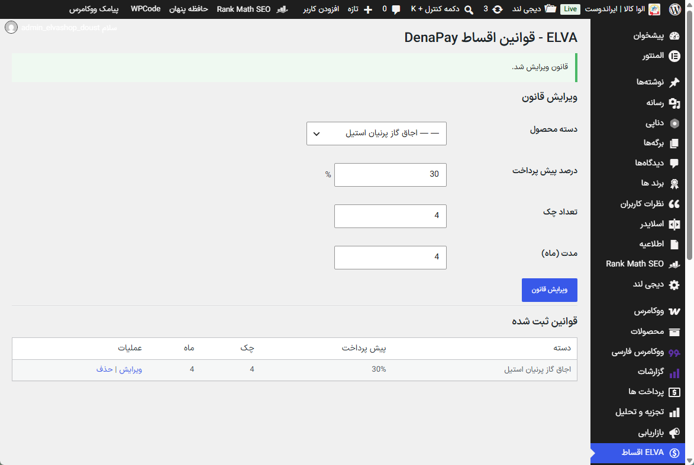
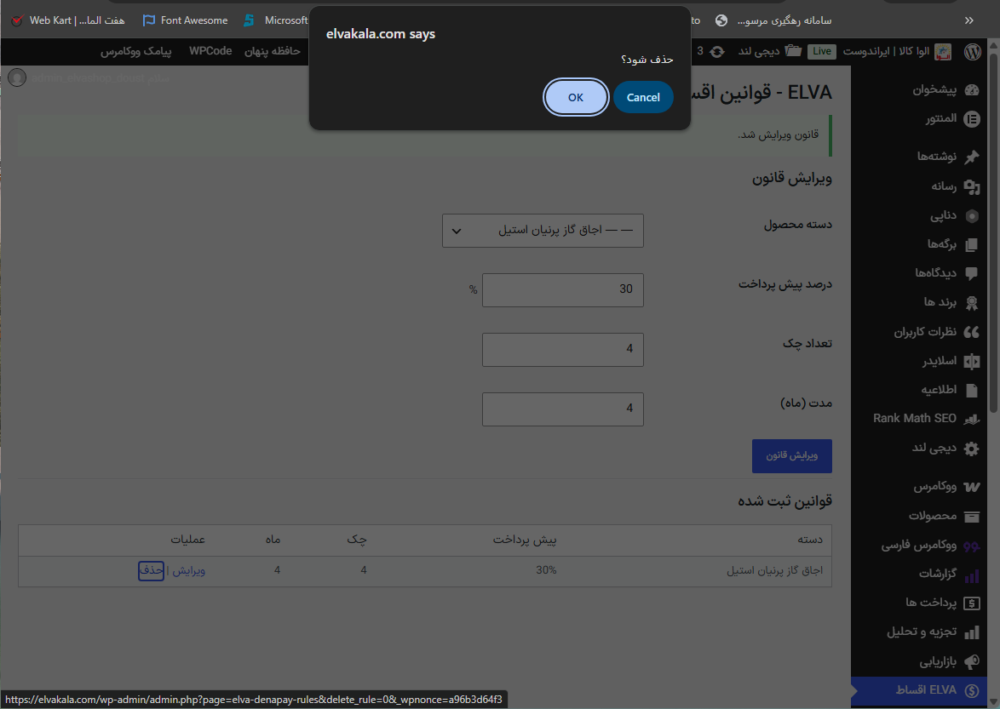

# ELVA DenaPay Rules Manager --- Rule Management Implementation

This document describes the implementation and verification of the ELVA
installment rule management panel.

The purpose of this component is to provide a business rule management
layer before synchronizing installment configurations with DenaPay.

------------------------------------------------------------------------

# Implementation Goal

The initial goal was to create a separate rule management interface
where ELVA business rules can be defined without directly modifying
DenaPay data.

The rule manager allows defining installment conditions based on
WooCommerce product categories.

Example:

    Category:
    Built-in Gas Cookers - Parnian

    Rule:
    20% initial payment
    5 checks
    5 months

------------------------------------------------------------------------

# Admin Panel Implementation

A new WordPress admin menu was added:

    ELVA اقساط

This page provides:

-   Creating new installment rules
-   Selecting WooCommerce product categories
-   Defining payment percentage
-   Defining number of checks
-   Defining installment duration
-   Viewing saved rules
-   Editing existing rules
-   Deleting rules

------------------------------------------------------------------------

# Rule Storage

Rules are stored in WordPress options.

The rule manager currently stores business rules only.

It does not:

-   Modify DenaPay metadata
-   Update products
-   Calculate installment amounts
-   Run synchronization

These responsibilities belong to the synchronization layer.

------------------------------------------------------------------------

# Verification Process

## Create Rule

A new installment rule was created successfully.

## Verify Saved Rule

The created rule appeared correctly in the saved rules table.

## Edit Rule

Existing rules can be loaded and updated.

## Delete Rule

Delete operation was tested with confirmation.

After deletion:

------------------------------------------------------------------------

# Current Architecture Position

    ELVA Rule Manager

            |
            v

    Business Rules Storage

            |
            v

    DenaPay Synchronization Engine

            |
            v

    DenaPay Product Metadata

------------------------------------------------------------------------

# Decision

The installment logic is separated from DenaPay.

ELVA manages:

-   Business rules
-   Category selection
-   Installment conditions

DenaPay remains responsible for:

-   Displaying installment options
-   Checkout integration
-   Payment processing

------------------------------------------------------------------------

# Next Step

The next implementation phase is the synchronization engine.

The synchronization engine will:

1.  Read saved ELVA rules.
2.  Find matching WooCommerce products.
3.  Calculate installment values based on current product prices.
4.  Update DenaPay product installment metadata.
