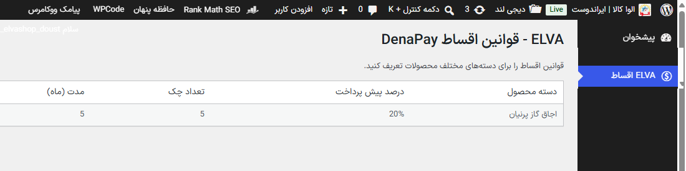
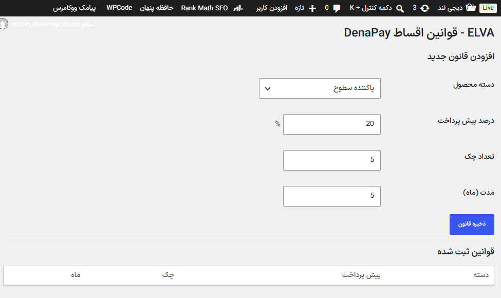

# ELVA Installment Manager — Plugin Implementation

This document describes the implementation details of the ELVA Installment Manager plugin.

The plugin was created to manage installment business rules independently from DenaPay and provide an automation layer for applying those rules to WooCommerce products.

---

# Admin Panel Implementation

## ELVA Installment Rules Menu

After validating the DenaPay integration approach, an initial admin interface was created inside WordPress.

The purpose of this interface is to provide a dedicated place for managing installment business rules.

Screenshot:



At this stage, the panel contains the initial rule structure:

- Product category
- Prepayment percentage
- Number of checks
- Installment duration

Example:
``` text
Category:
Built-in Gas Cookers

Prepayment:
20%

Checks:
5

Duration:
5 months
```

The current implementation represents the first step toward replacing hard-coded installment rules with configurable business rules.

Future versions will allow:

- Creating multiple rules
- Assigning rules to WooCommerce categories
- Defining priority between rules
- Synchronizing matched products with DenaPay metadata

---
# ELVA Installment Rules Admin Panel

After validating the DenaPay integration approach, an initial administration panel was implemented inside WordPress.

The purpose of this panel is to manage installment business rules separately from DenaPay implementation details.

The panel allows administrators to define rules based on WooCommerce product categories.

Screenshot:


Current rule configuration includes:

- WooCommerce product category
- Prepayment percentage
- Number of checks
- Installment duration (months)

Example:
``` text
Category:
Built-in Gas Cookers - Parnian

Prepayment:
20%

Checks:
5

Duration:
5 months
```

At this stage, the panel only manages and stores business rules.

No product metadata is updated and no DenaPay synchronization is performed yet.

Future implementation:

``` text
ELVA Rule Manager
|
v
Find Matching Products
|
v
Calculate Installment Values
|
v
Update DenaPay Product Metadata
```

## Rule Management Interface

After creating the initial installment rules page, the rule management interface was extended to support dynamic WooCommerce category selection.

The purpose of this update was to allow administrators to create installment rules based on product categories instead of hard-coded values.

Screenshot:



The interface now supports:

- Selecting WooCommerce product categories
- Defining prepayment percentage
- Defining number of checks
- Defining installment duration

Example:

``` text
Category:
Built-in Gas Cookers - Parnian

Prepayment:
20%

Checks:
5

Duration:
5 months
```

At this stage, rules are stored as business configurations only.

The rules are not yet applied automatically to products and DenaPay synchronization is implemented in later stages.
