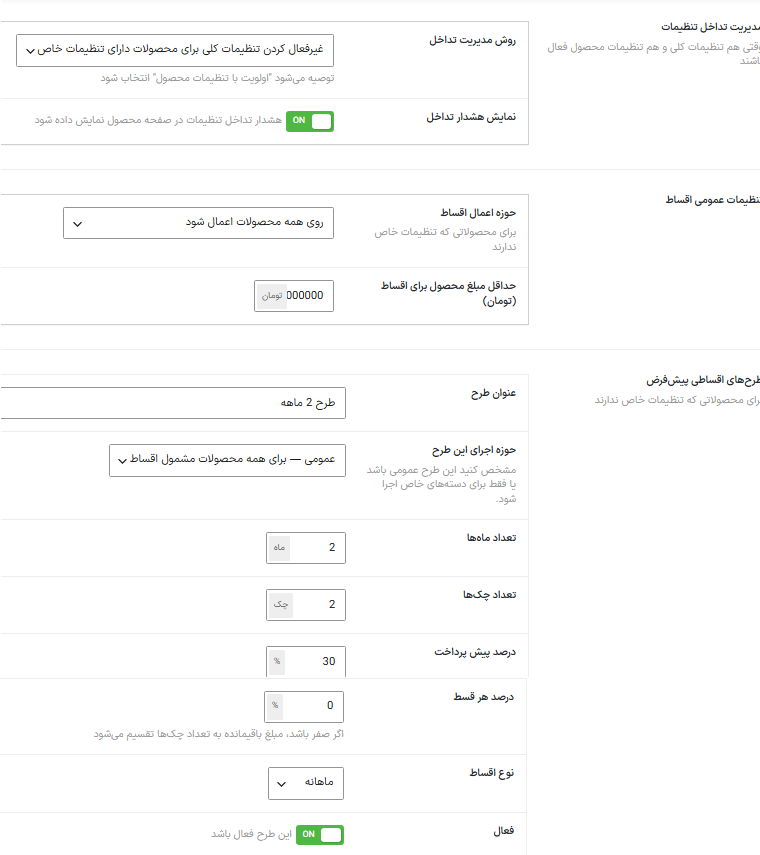
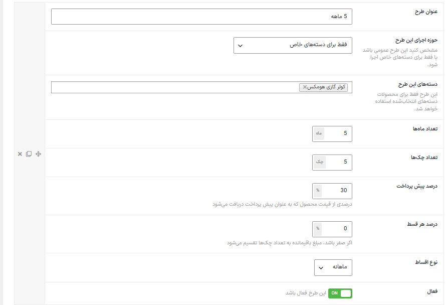
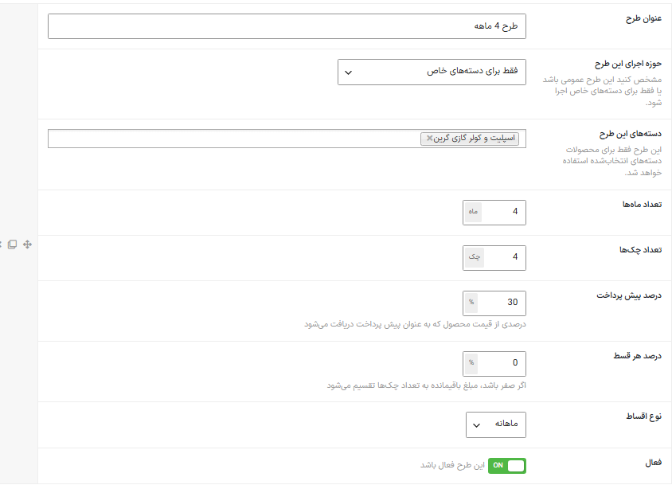
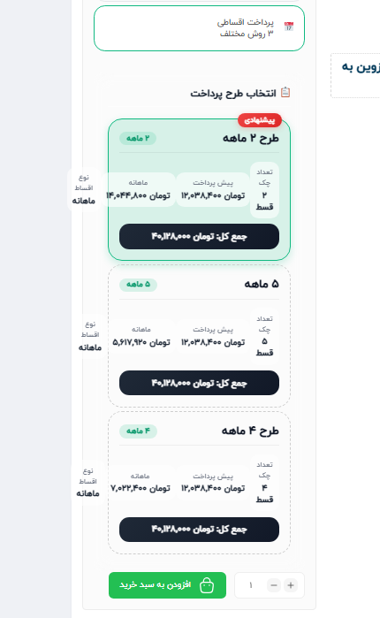

# Approach A — MehranPay Global-Plan Filtering

## Hypothesis

Extend each DenaPay default plan with a scope:

- `global`
- `specific_categories`

Existing plans without the new field would remain global for backward
compatibility.

## What worked

- Scope field added to the default-plan editor
- WooCommerce category selector added
- Category options loaded through DenaPay's existing category provider
- Global and category-specific configurations saved
- Initial rule matcher and compatibility bridge created

## Failure observed

The product page still displayed all three plans, including plans assigned to
other categories.

## Root architectural problem

DenaPay read default plans from several internal components rather than one
stable public extension point. Patching only one reader did not guarantee
consistent behavior across:

- product display;
- plan normalization;
- cart processing;
- checkout calculations;
- order processing.

Adding more patches increased maintenance and upgrade risk. The experiment was
rolled back instead of turning the third-party plugin into a fragile fork.

## Archived code

The `experiments/mehranpay/` files preserve the research direction. They are
not a complete plugin and must not be installed as production software.

