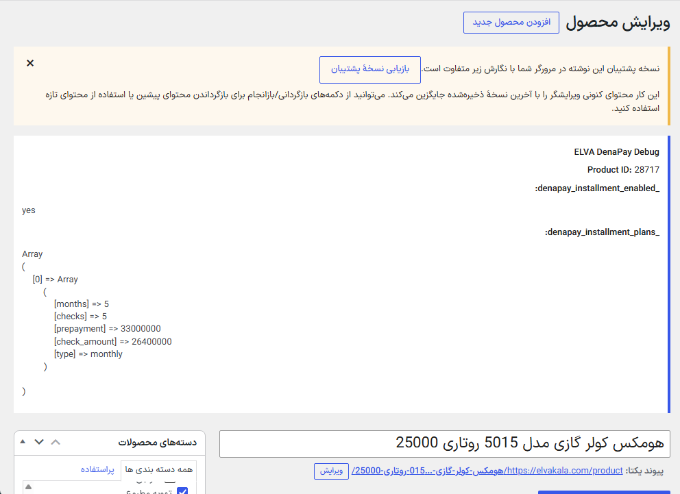
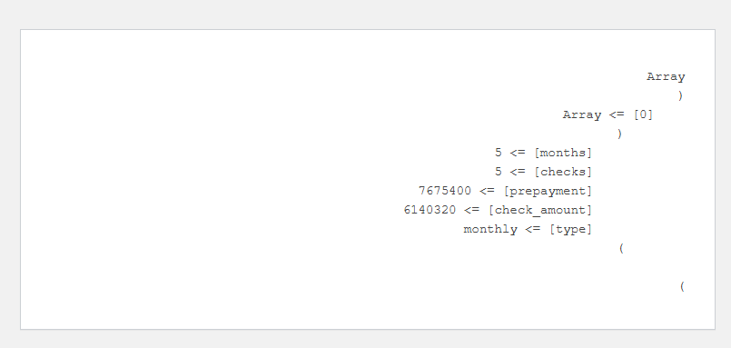
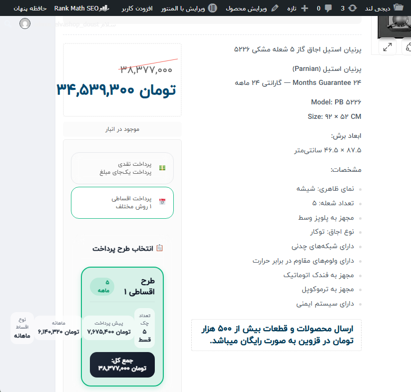

# Approach B — Product Metadata Automation

## Decision

Generate the product-level structure DenaPay already understands instead of
filtering every global-plan read path.

## Investigation sequence

1. Configure one product manually.
2. Inspect its saved metadata.
3. Reproduce the calculation without saving.
4. Write one controlled product plan.
5. Read the generated metadata back.
6. Verify native storefront rendering.
7. Run category discovery and calculations without writes.

## Formula

For product price `P`, prepayment rate `R`, and `N` checks:

```text
prepayment   = round(P × R / 100)
check_amount = round((P − prepayment) / N)
```

Recorded example:

```text
Price: 38,377,000
Rate: 20%
Checks: 5
Prepayment: 7,675,400
Each check: 6,140,320
```

## Evidence









## Why this direction was selected

- DenaPay receives its native data shape.
- Product-page behavior remains owned by DenaPay.
- Bulk work can be validated before writes.
- Business rules can remain percentage-based while stored product values remain
  fixed amounts.

The production writer and synchronization engine are private.

