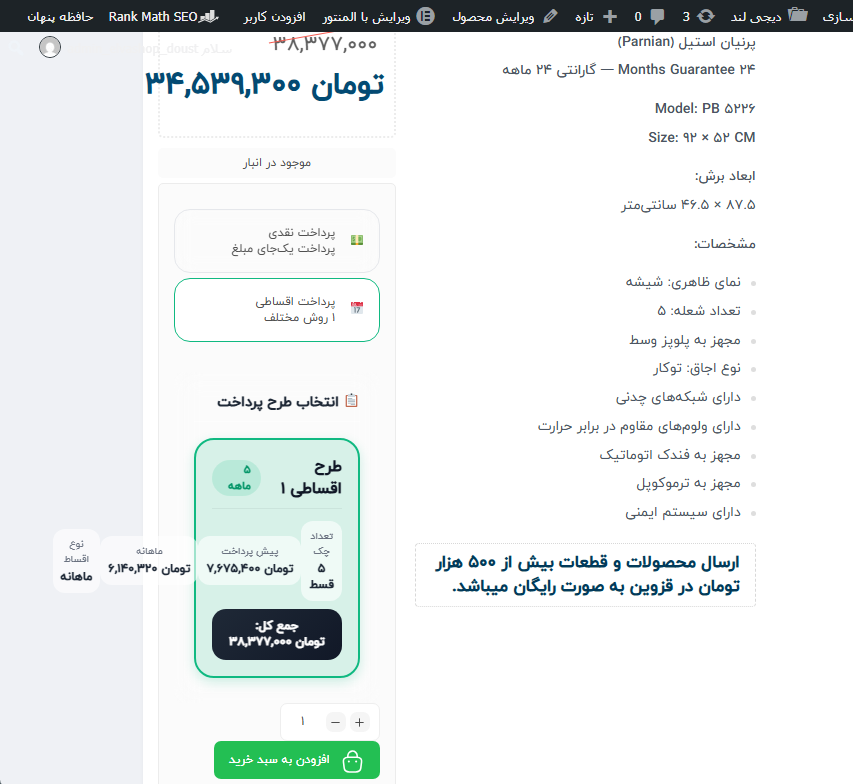
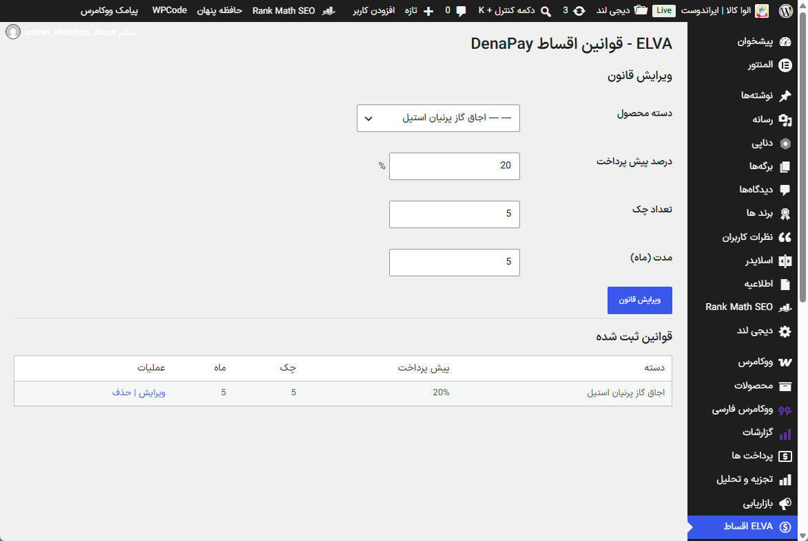
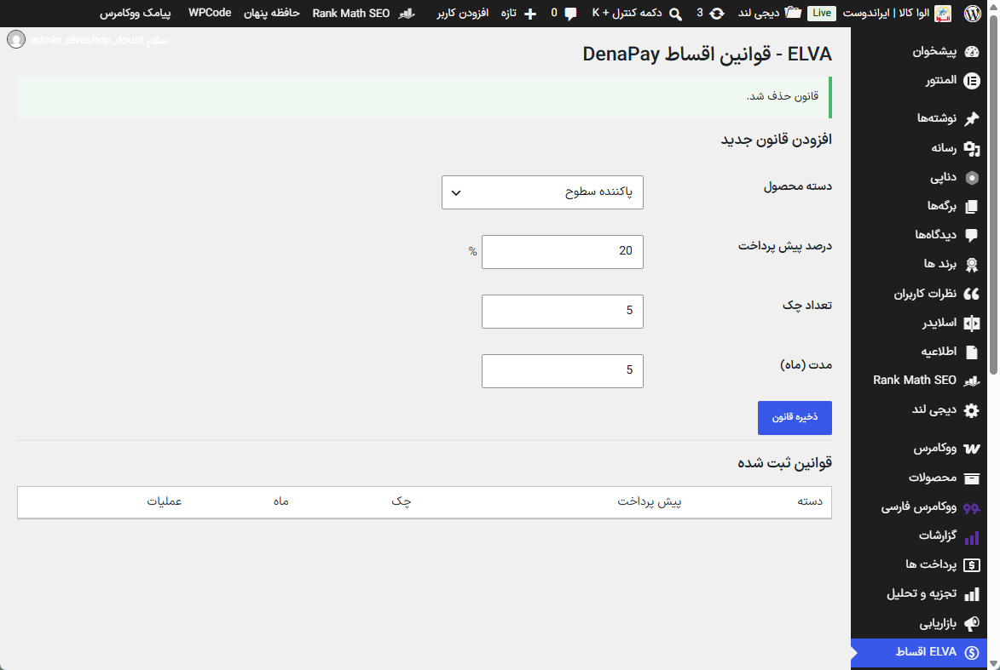
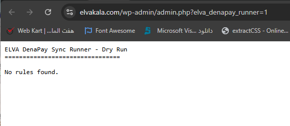
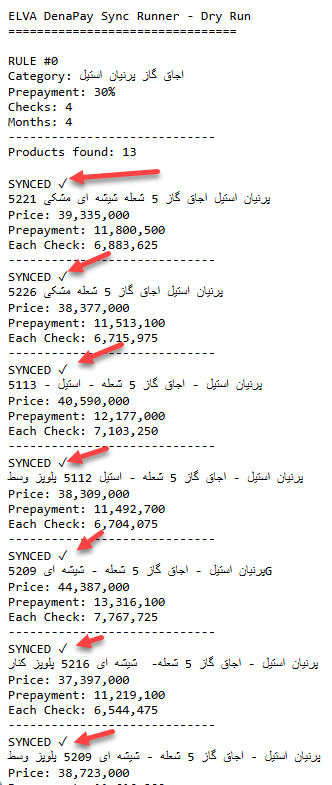

# Private Rule Management and Controlled Sync

## Rule Manager

A private WordPress admin module was implemented with:

- hierarchical WooCommerce category selection;
- prepayment percentage;
- check count;
- duration in months;
- rule listing;
- create, edit, and delete operations.

The create, persistence, edit, confirmation, and delete flows were functionally
tested.








## Runner progression

The first saved-rules Runner request reached the endpoint but returned:

```text
No rules found.
```



The integration was subsequently corrected. A stored 30% prepayment,
four-check, four-month rule matched 13 published products. The controlled Runner
reported `SYNCED ✓` entries and product-specific calculations.



## Evidence boundary

The final product page was not revisited after this last batch. Therefore the
Runner report proves reported execution, but this repository does not claim a
separate post-batch storefront verification of the 30% / 4 / 4 configuration.

## Private implementation

No admin-menu, CRUD, stored-rule loader, batch writer, nonce flow, logging,
recovery, or synchronization source is published. These components form the
commercial plugin.

