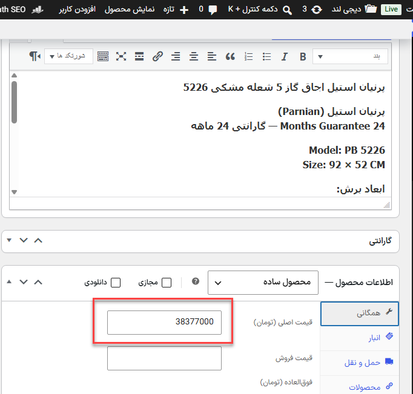
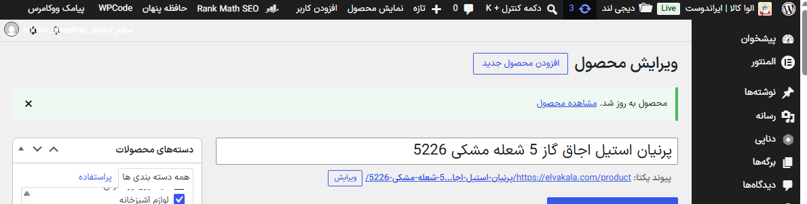
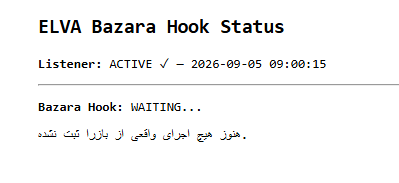

# Price Change and Bazara/Mahak Integration

## Why price synchronization is required

DenaPay product metadata contains fixed monetary amounts. When a WooCommerce
price changes, the prepayment and check amounts can become stale.

## Generic WooCommerce trigger test

A generic product-update listener was tested on product 5226. The product was
updated, but the expected ELVA-specific listener notice did not appear.

This test did not validate automatic synchronization.

## Bazara/Mahak direction

Product prices are updated through the Bazara connector for Mahak. The next
engineering direction was to identify the connector's real price-sync lifecycle
rather than rely on a broad WooCommerce hook.

A private listener/status mechanism was installed and confirmed active, but no
real Bazara execution had been observed at the recorded checkpoint:

## Current status

- Manual and controlled batch sync: validated
- Generic automatic price trigger: not validated
- Bazara listener installation: active/waiting
- Real Bazara hook execution: not observed in supplied evidence

Listener code, hook names, stored status flags, and synchronization callbacks
are private commercial implementation details.

