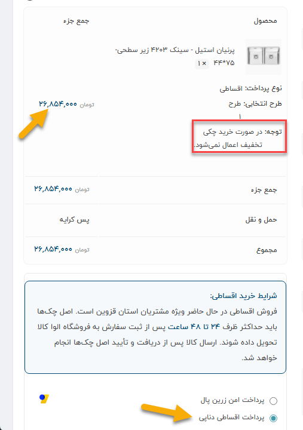
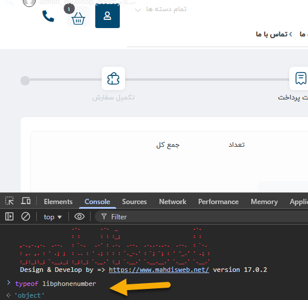
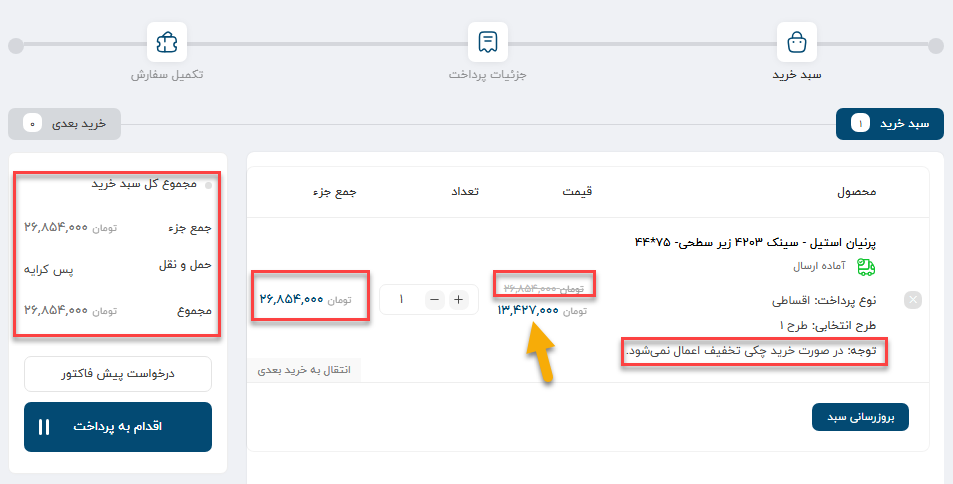
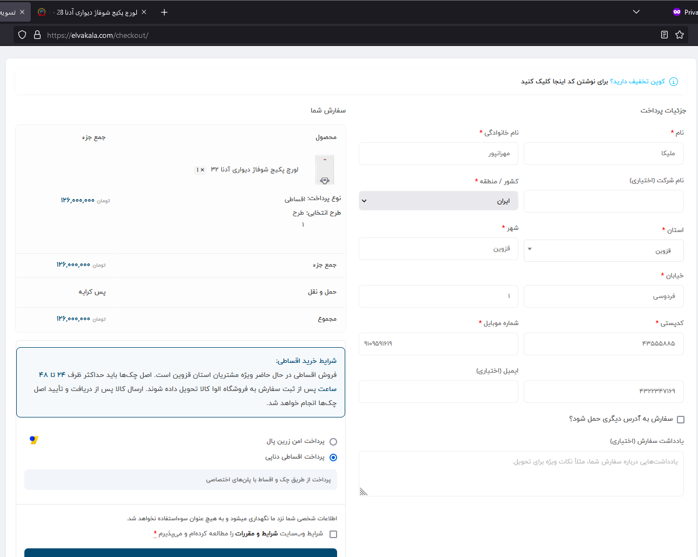

# Related Checkout Validation

These checks supported the installment project but are not part of the private
rule engine.

## Discount behavior

Installment purchases were expected to use the non-discounted product price.
Cart and checkout states were inspected to verify the warning and resulting
price presentation.

## Checkout dependency

The checkout flow was blocked when the Digits phone-number dependency was not
loaded. The before/after Console checks recorded `undefined` and then `object`.

The successful state allowed the flow to proceed to the payment stage.

## Store policy presentation

The product page, installment details, and cart were also checked for the
installment notice and check-delivery policy.

Third-party library bundles and checkout customer data are not included.

