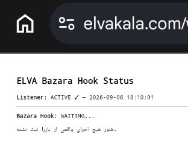
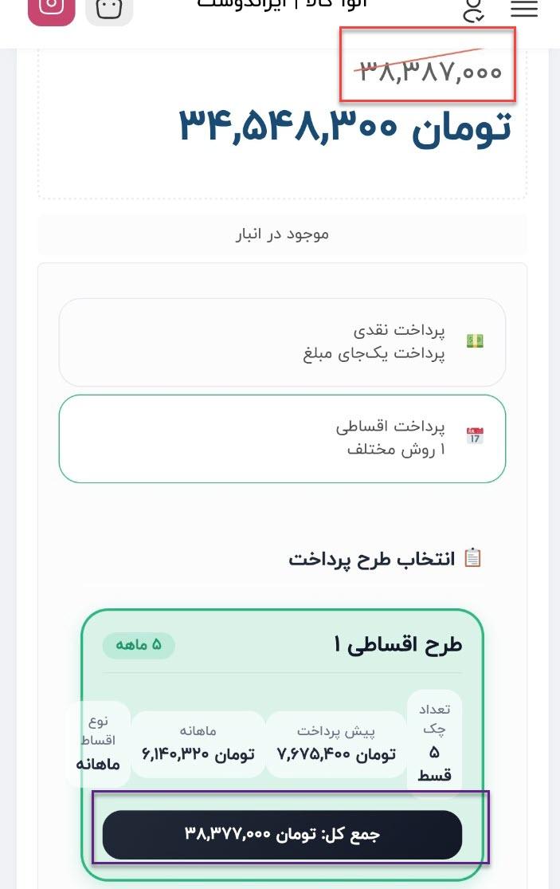

# رفع باگ‌های پس از انتشار سیستم اقساط ELVA

این گزارش مشکلاتی را ثبت می‌کند که پس از انتشار اولیه سیستم مدیریت قوانین
اقساط ELVA در محیط واقعی فروشگاه مشاهده شدند. دو مشکل اصلی در ۱۶ شهریور ۱۴۰۵
(۷ سپتامبر ۲۰۲۶) بررسی، اصلاح و آزمایش شدند:

1. قانون دسته ذخیره می‌شد، اما روی محصولات آن دسته اعمال نمی‌شد.
2. پس از تغییر قیمت محصول، مبالغ ثابت پلن اقساط با قیمت جدید همگام نمی‌شدند.

> این پوشه فقط گزارش فنی و شواهد تست را منتشر می‌کند. سورس Rules Manager،
> Metadata Writer، موتور Sync و اتصال عملیاتی DenaPay/Bazara خصوصی باقی مانده‌اند.

## مشکل اول: قانون ذخیره‌شده روی محصولات اعمال نمی‌شد

### وضعیت قبل از اصلاح

برای دسته اجاق گاز بیمکث قانون جدیدی تعریف شده بود، اما یکی از محصولات همچنان
پلن قدیمی دو قسط و دو ماه را نمایش می‌داد.


در همان زمان، قانون بیمکث با موفقیت در جدول قوانین ثبت‌شده دیده می‌شد. بنابراین
ذخیره قانون انجام شده بود، ولی این ذخیره به معنی اعمال آن روی متادیتای محصولات
دسته نبود.


### علت مشکل

در نسخه اولیه، Rules Manager فقط اطلاعات قانون را در تنظیمات وردپرس ذخیره
می‌کرد. افزودن یا ویرایش قانون هیچ عملیات گروهی برای بازنویسی پلن اختصاصی
DenaPay محصولات اجرا نمی‌کرد. به همین دلیل دو مرحله متفاوت، یعنی «ذخیره قانون»
و «اعمال قانون روی محصولات»، در رابط مدیریت از یکدیگر قابل تشخیص نبودند.

### راه‌حل

برای هر قانون یک عملیات مستقل با عنوان «اعمال روی محصولات» اضافه شد. این عملیات:

- فقط محصولات منتشرشده دسته انتخابی و زیردسته‌های آن را پیدا می‌کند؛
- مبالغ را از قیمت اصلی ووکامرس محاسبه می‌کند؛
- قیمت تخفیفی خرید نقدی را وارد محاسبات اقساط نمی‌کند؛
- پلن اختصاصی را با ساختار بومی DenaPay در متادیتای محصول ذخیره می‌کند؛
- کش و Transientهای مرتبط با محصول را پاک می‌کند؛
- تعداد محصولات یافت‌شده، موفق و ردشده را گزارش می‌دهد.

ذخیره و ویرایش قانون عمداً از اجرای گروهی جدا باقی ماند تا یک تغییر مدیریتی،
بدون تأیید صریح، صدها محصول را تغییر ندهد.

### نتیجه تست

در اجرای قانون بیمکث، ۱۳ محصول پیدا شد و هر ۱۳ محصول با موفقیت همگام شدند؛ هیچ
محصولی رد نشد.


پس از اجرا، محصول آزمایشی بیمکث به‌جای پلن قدیمی، قانون جدید با پیش‌پرداخت ۳۰٪،
پنج چک و مدت پنج ماه را نمایش داد. جمع کل پلن نیز با قیمت اصلی محصول برابر بود.


## مشکل دوم: قیمت جدید در اقساط همگام نمی‌شد

### وضعیت قبل از اصلاح

Listener اولیه فعال بود، اما برای اجرای واقعی بازارا همچنان وضعیت `WAITING` را
نشان می‌داد. در نتیجه رویدادی برای بازسازی پلن اقساط ثبت نمی‌شد.



در نمونه پرنیان، قیمت اصلی محصول به ۳۸٬۳۸۷٬۰۰۰ تومان تغییر کرده بود، اما جمع
کل پلن اقساط همچنان ۳۸٬۳۷۷٬۰۰۰ تومان باقی مانده بود. تعداد اقساط تغییر می‌کرد،
ولی مبلغ‌های ثابت پلن هنوز از قیمت قبلی آمده بودند.



### علت مشکل

Listener اولیه فقط به Hook اختصاصی مسیر Import جدید بازارا متصل بود. بررسی
نسخه نصب‌شده بازارا نشان داد مسیر عملیاتی دیگری نیز برای ایجاد یا به‌روزرسانی
محصول استفاده می‌شود. این مسیر محصول را با `WC_Product::save()` ذخیره می‌کند،
اما Hook اختصاصی Importer را اجرا نمی‌کند؛ بنابراین Listener قبلی همیشه تمام
تغییرات واقعی قیمت را دریافت نمی‌کرد.

### راه‌حل

Auto Sync به رویداد اصلی ذخیره محصول در ووکامرس متصل شد و Hook اختصاصی بازارا
نیز به‌عنوان مسیر پشتیبان باقی ماند. پس از هر ذخیره محصول، سیستم اکنون:

1. دسته‌های محصول و قانون منطبق را پیدا می‌کند؛
2. قیمت اصلی روز را از ووکامرس می‌خواند؛
3. پیش‌پرداخت و مبلغ هر چک را دوباره محاسبه می‌کند؛
4. متادیتای اختصاصی DenaPay را به‌روزرسانی می‌کند؛
5. نتیجه آخرین رویداد را برای بررسی فنی ثبت می‌کند.

### نتیجه تست محاسبات

پس از اصلاح، قیمت اصلی و پلن اقساط پرنیان کاملاً هماهنگ شدند:

| مورد | مبلغ |
| --- | ---: |
| قیمت اصلی محصول | ۳۸٬۳۸۷٬۰۰۰ تومان |
| پیش‌پرداخت ۳۰٪ | ۱۱٬۵۱۶٬۱۰۰ تومان |
| مانده پس از پیش‌پرداخت | ۲۶٬۸۷۰٬۹۰۰ تومان |
| مبلغ هرکدام از پنج چک | ۵٬۳۷۴٬۱۸۰ تومان |
| جمع کل پلن اقساط | ۳۸٬۳۸۷٬۰۰۰ تومان |

قیمت تخفیفی نقدی ۳۴٬۵۴۸٬۳۰۰ تومان در این محاسبات وارد نشد.


برای تأیید نهایی، قیمت اصلی یک محصول پرنیان به‌صورت کنترل‌شده ذخیره شد؛ بدون
استفاده از دکمه «اعمال روی محصولات». گزارش Listener نتیجه زیر را ثبت کرد:

- رویداد ذخیره محصول: `FIRED`
- شناسه محصول: `28336`
- وضعیت: `synced`
- قانون منطبق: `اجاق گاز پرنیان استیل`
- قیمت مبنای محاسبه: `38387000`


## جمع‌بندی تست‌ها

| سناریو | نتیجه |
| --- | --- |
| افزودن و ذخیره قانون دسته | موفق |
| ویرایش و ذخیره قانون دسته | موفق |
| تفکیک ذخیره قانون از اعمال گروهی | موفق |
| اعمال قانون بیمکث روی ۱۳ محصول | ۱۳ موفق، بدون خطا |
| نمایش قانون جدید در صفحه محصول | موفق |
| استفاده از قیمت اصلی به‌جای قیمت تخفیفی | موفق |
| تشخیص رویداد ذخیره محصول ووکامرس | موفق |
| تشخیص قانون دسته پرنیان | موفق |
| محاسبه مجدد پلن بعد از ذخیره قیمت | موفق |
| برابری جمع اقساط با قیمت اصلی | موفق |

## وضعیت نهایی

پس از این اصلاحات، جریان عملیاتی سیستم به شکل زیر است:

```text
تعریف یا ویرایش قانون دسته
        ↓
ذخیره قانون بدون تغییر ناخواسته محصولات
        ↓
اعمال صریح قانون روی محصولات دسته
        ↓
ذخیره قیمت جدید توسط ووکامرس/بازارا
        ↓
تشخیص خودکار قانون همان محصول
        ↓
بازسازی مبالغ اقساط براساس قیمت اصلی روز
```

هر دو باگ مشاهده‌شده پس از انتشار رفع شدند و نتیجه در پنل مدیریت، گزارش فنی و
صفحه محصول تأیید شد.
