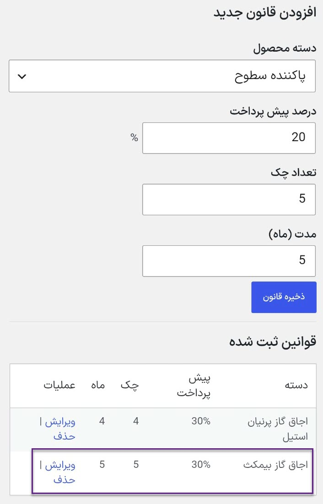
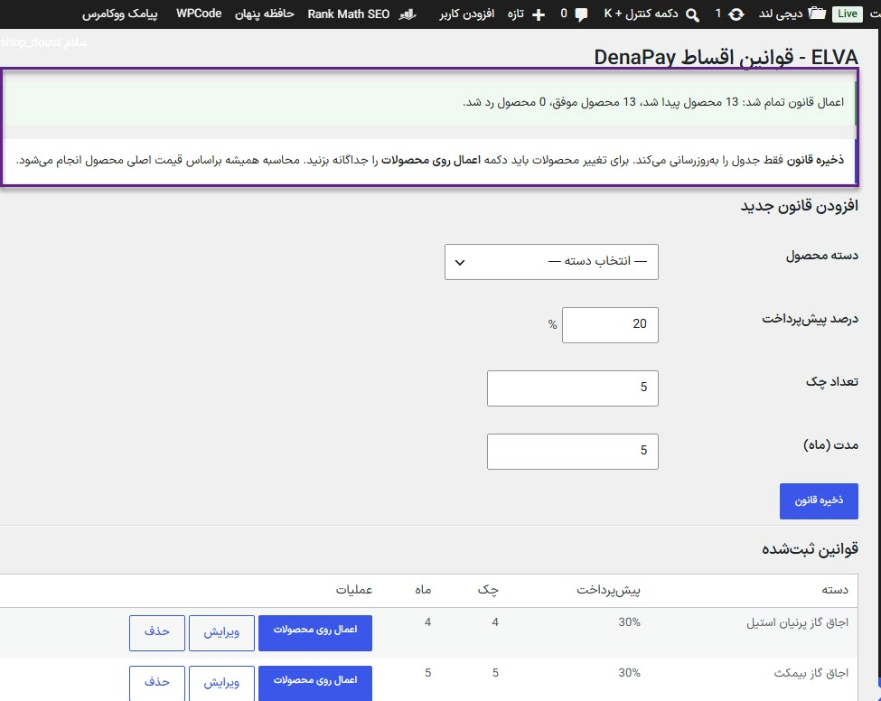
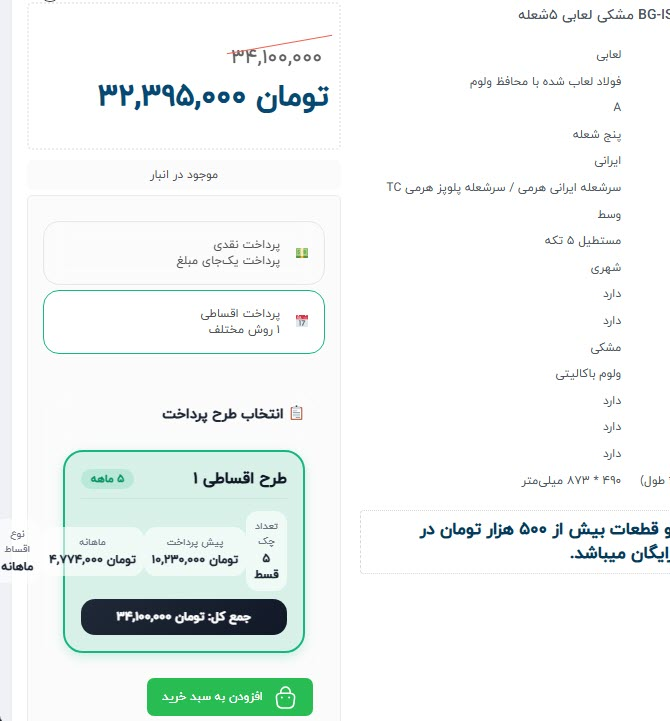
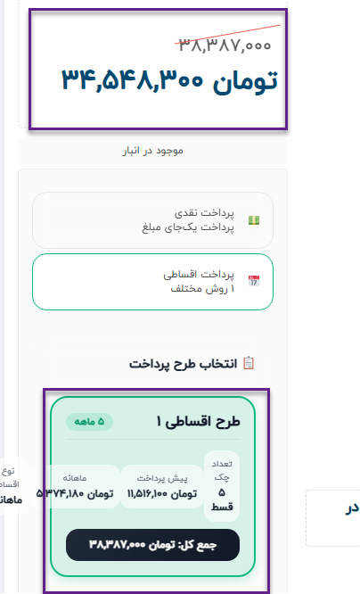
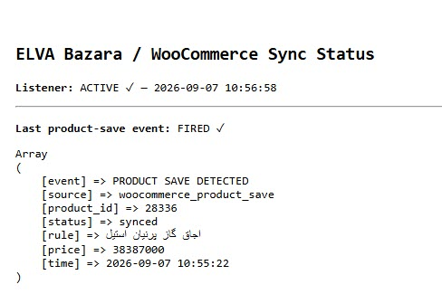

# Post-Release Fixes for the ELVA Installment System

This report documents issues discovered after the initial production release of
the ELVA installment rule-management system. Two main problems were investigated,
fixed, and verified in the live WooCommerce workflow on September 7, 2026:

1. A category rule was saved successfully but was not applied to products in that category.
2. After a product price changed, the fixed installment amounts were not synchronized with the new price.

> This directory publishes only the technical report and test evidence. The
> Rules Manager, metadata writer, synchronization engine, and operational
> DenaPay/Bazara integration source code remain private.

## Issue 1: A saved rule was not applied to products

### Behavior before the fix

A new rule had been created for the Bimax cooktop category, but one of its
products continued to display the previous two-installment, two-month plan.


At the same time, the Bimax rule appeared correctly in the Rules Manager table.
The rule had therefore been persisted, but saving it had not updated the
DenaPay metadata of products in the category.



### Root cause

The initial Rules Manager only stored rule definitions in the WordPress options
table. Creating or editing a rule did not start a batch operation to rewrite the
product-level DenaPay plan metadata. As a result, two separate operations—saving
a rule and applying it to products—were presented as though they were a single
operation.

### Resolution

An explicit **Apply to products** action was added for every stored rule. The
operation now:

- targets only published products in the selected category and its child categories;
- calculates installment amounts from WooCommerce Regular Price;
- excludes the cash Sale Price from installment calculations;
- writes product-specific metadata in DenaPay's native structure;
- clears related product caches and transients;
- reports the number of products found, synchronized, and skipped.

Rule persistence intentionally remains separate from batch execution. This
prevents an administrative edit from unexpectedly modifying hundreds of
products without explicit confirmation.

### Verification

The corrected Bimax run found 13 products and synchronized all 13 successfully,
with no skipped products.



After the operation, the test product displayed the new rule with a 30%
prepayment, five checks, and a five-month duration. The plan total also matched
the product's Regular Price.



## Issue 2: Updated prices were not synchronized with installment amounts

### Behavior before the fix

The original listener was active but remained in the `WAITING` state during the
actual Bazara workflow. No event was recorded to rebuild the installment plan.


In the Parnian test product, the WooCommerce Regular Price had changed to
38,387,000 toman, while the installment plan still totaled 38,377,000 toman.
The installment count could be updated, but the fixed monetary values still
came from the previous price.


### Root cause

The original listener depended only on an importer-specific Bazara completion
hook. Inspection of the installed Bazara version showed another active product
creation and update path. That path saves products through
`WC_Product::save()` but does not fire the importer-specific hook, so the
listener did not observe every production price update.

### Resolution

Auto Sync was connected to WooCommerce's product-save events, while the
Bazara-specific hook was retained as an additional fallback. After a product is
saved, the system now:

1. resolves the category rule assigned to the product;
2. reads the current WooCommerce Regular Price;
3. recalculates the prepayment and check amounts;
4. updates the product-specific DenaPay metadata;
5. records the result of the latest detected product-save event.

### Calculation verification

After the fix, the Parnian product price and installment plan matched exactly:

| Item | Amount |
| --- | ---: |
| Product Regular Price | 38,387,000 toman |
| 30% prepayment | 11,516,100 toman |
| Remaining balance | 26,870,900 toman |
| Each of five checks | 5,374,180 toman |
| Installment plan total | 38,387,000 toman |

The cash Sale Price of 34,548,300 toman was not used in the installment
calculation.



For final verification, the Regular Price of a Parnian product was saved in a
controlled test without using the category-level **Apply to products** action.
The listener recorded:

- Product-save event: `FIRED`
- Product ID: `28336`
- Status: `synced`
- Matched rule: Parnian cooktops
- Calculation price: `38387000`



## Verification summary

| Scenario | Result |
| --- | --- |
| Create and store a category rule | Passed |
| Edit and store a category rule | Passed |
| Separate rule persistence from batch application | Passed |
| Apply the Bimax rule to 13 products | 13 synchronized, 0 skipped |
| Render the new rule on the product page | Passed |
| Use Regular Price instead of Sale Price | Passed |
| Detect a WooCommerce product-save event | Passed |
| Match the stored Parnian category rule | Passed |
| Recalculate the installment plan after a price save | Passed |
| Keep the installment total equal to Regular Price | Passed |

## Final workflow

After these fixes, the operational flow is:

```text
Create or edit a category rule
        ↓
Save the rule without unexpectedly modifying products
        ↓
Explicitly apply the rule to products in the category
        ↓
WooCommerce/Bazara saves an updated product price
        ↓
Automatically resolve the product's category rule
        ↓
Rebuild installment amounts from the current Regular Price
```

Both post-release issues were resolved, and the results were verified in the
administration interface, diagnostic status output, and storefront product
page.
