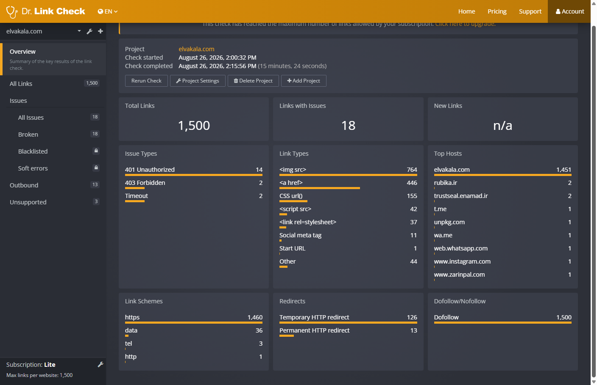

### Broken Links Check ✅

- **Tool:** Dr. Link Check
- **Date:** 2026-08-26
- **Links scanned:** 1,500
- **404 / actual broken links:** 0
- **401 Unauthorized:** 14 — WordPress REST API endpoints
- **403 Forbidden:** 2 — WordPress oEmbed endpoints
- **Timeout:** 2 — Enamad trust seal endpoints
- Enamad trust seal was manually verified and opened successfully.
- **Final result:** PASS ✅ — No user-facing broken links detected.

### Evidence

