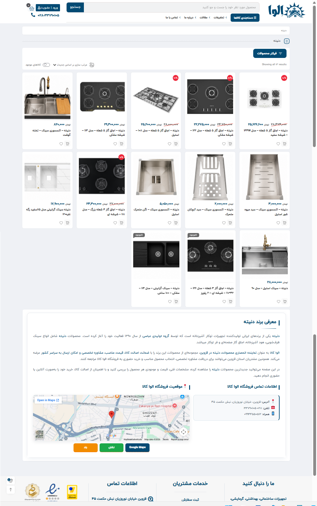
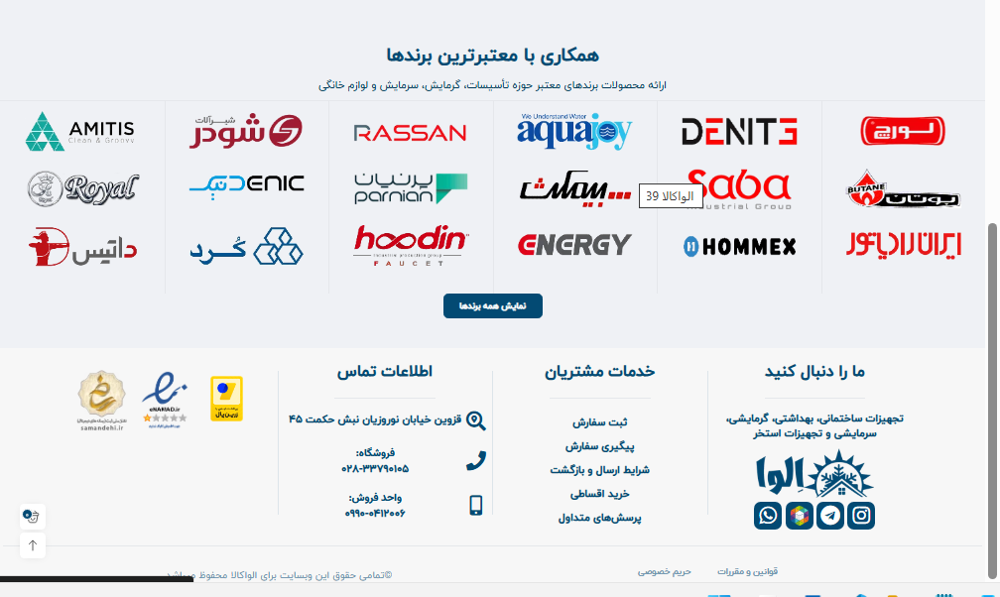
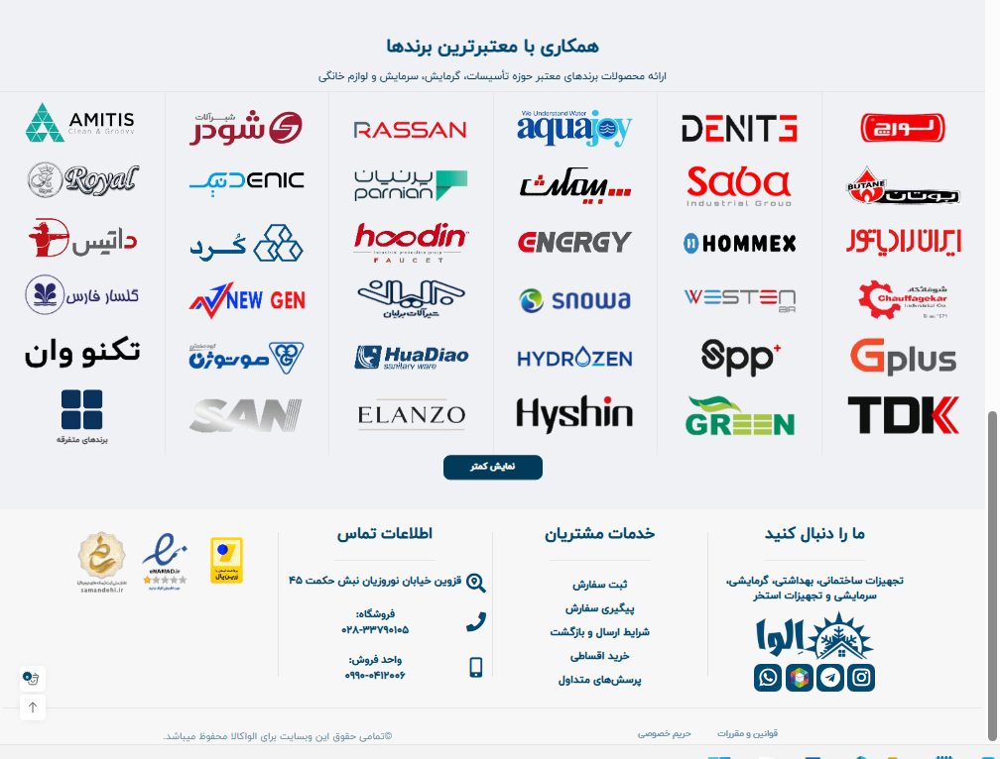

# ELVA KALA — Brand Customizations

Custom front-end code used for brand-related sections of the ELVA KALA website.

This directory contains customizations for:

- WooCommerce brand description pages
- The brands section on the homepage

The code is kept separate from the original theme files so the custom behavior and styling can be maintained independently.

---

## `brand-description.css`

Custom layout and styling for WooCommerce brand description pages.

The stylesheet targets the existing `.term-description-wrap` structure and turns the brand description area into a structured information section containing the brand introduction, contact information, store location, and navigation links.

### Brand Introduction

The main brand description is displayed inside a dedicated card with:

- Full-width brand heading
- Styled heading accent
- Brand introduction paragraphs
- Highlighted strong text
- Custom spacing, borders, radius, and shadow

### Contact and Location Layout

On desktop, the content uses a two-column grid:

- Contact information in the first column
- Store location and map in the second column

The brand title and introduction text remain full width above both columns.

### Contact Information

The stylesheet includes dedicated styling for:

- Contact section title
- Contact information card
- Address and phone information
- Emoji/icon sizing
- ELVA KALA brand colors

The contact markup itself is provided by the related ELVA contact shortcode.

### Store Location

The location section includes styling for:

- Embedded map
- Location heading
- Map container
- Navigation buttons
- Hover interaction for navigation links

The location markup itself is provided by the related ELVA location shortcode.

### Responsive Behavior

At tablet widths, the two-column grid changes to a single-column layout.

On mobile:

- Padding and typography are reduced
- Contact and location sections remain stacked
- Map height is adjusted
- Navigation buttons use a responsive layout
- On very small screens, navigation buttons become full width

### Theme Compatibility Fix

The theme's default `.loadmore` control inside the term description is hidden because the complete custom brand description is intended to remain visible.

### Screenshot

---

## `homepage-brands-toggle.php`

Expandable/collapsible brands section used on the ELVA KALA homepage.

The implementation contains its own PHP hook, CSS, and JavaScript and is injected through `wp_footer`.

It does not run while Elementor is in editor mode.

### Default State

The homepage brand section is collapsed by default.

Only the first three brand widgets in each Elementor column are displayed.

With the current six-column homepage structure, this results in 18 brands being visible in the collapsed desktop layout.

### Expanded State

Clicking **Show All Brands** adds the `elva-brands-expanded` class to the brands section and reveals all brand items.

Newly revealed rows use a short fade-and-slide animation.

The button text changes between:

- `نمایش همه برندها`
- `نمایش کمتر`

### Dynamic Button Creation

The toggle button is created with JavaScript and inserted immediately after the Elementor brands section.

The script also:

- Prevents duplicate button creation
- Adds `aria-expanded`
- Adds `aria-controls`
- Assigns an ID to the controlled brands section
- Handles the expanded/collapsed state

### Collapse Behavior

When the expanded list is collapsed again, the page smoothly scrolls back toward the brands section so the user does not remain far below the now-shortened content.

### Elementor Delayed Rendering Support

The script initializes normally after DOM load.

It also includes a fallback retry mechanism for cases where Elementor inserts the brands section into the page with a delay.

Initialization is retried every 300 ms, up to 20 attempts.

### Responsive Behavior

The toggle button includes dedicated mobile styling for:

- Reduced spacing
- Smaller button dimensions
- Correct stacking position
- Touch interaction

### Screenshots

#### Collapsed

#### Expanded

---

## Relationship with Shortcodes

The brand description layout depends on the reusable ELVA shortcodes stored separately under:

`/snippets/custom-shortcodes/`

The relevant shortcodes are:

- `[elva_contact]`
- `[elva_location]`

These provide the contact information and map/location markup that `brand-description.css` styles inside brand descriptions.

Keeping the shortcode logic separate allows the same reusable components to be maintained independently from the brand-page presentation layer.

---

## Important Maintenance Notes

`homepage-brands-toggle.php` currently targets the Elementor section:

`elementor-element-95ccca0`

If the homepage brands section is rebuilt in Elementor and its generated element ID changes, the selector in this file must also be updated.

`brand-description.css` depends on the current term-description structure and the ELVA contact/location shortcode classes.

After changes to the theme, Elementor layout, WooCommerce taxonomy templates, or related shortcodes, verify:

- Brand introduction layout
- Contact information
- Embedded map
- Navigation buttons
- Tablet and mobile layouts
- Homepage collapsed brands state
- Homepage expanded brands state
- Show All / Show Less button behavior
