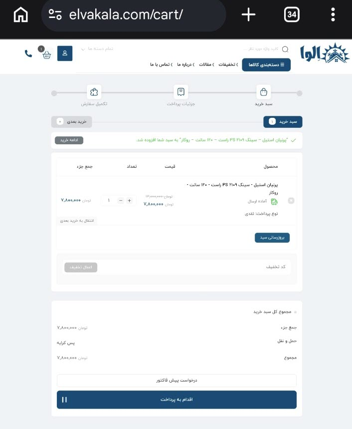
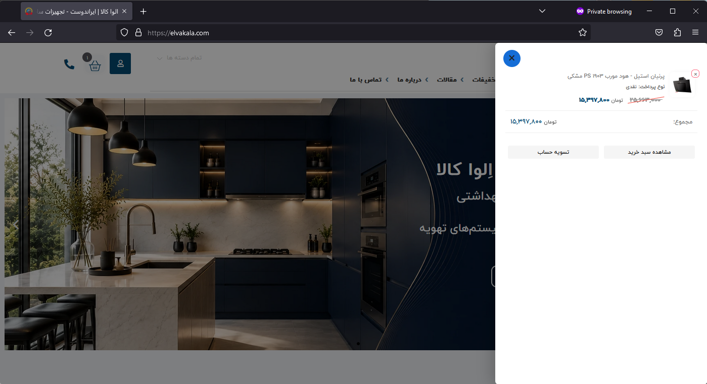
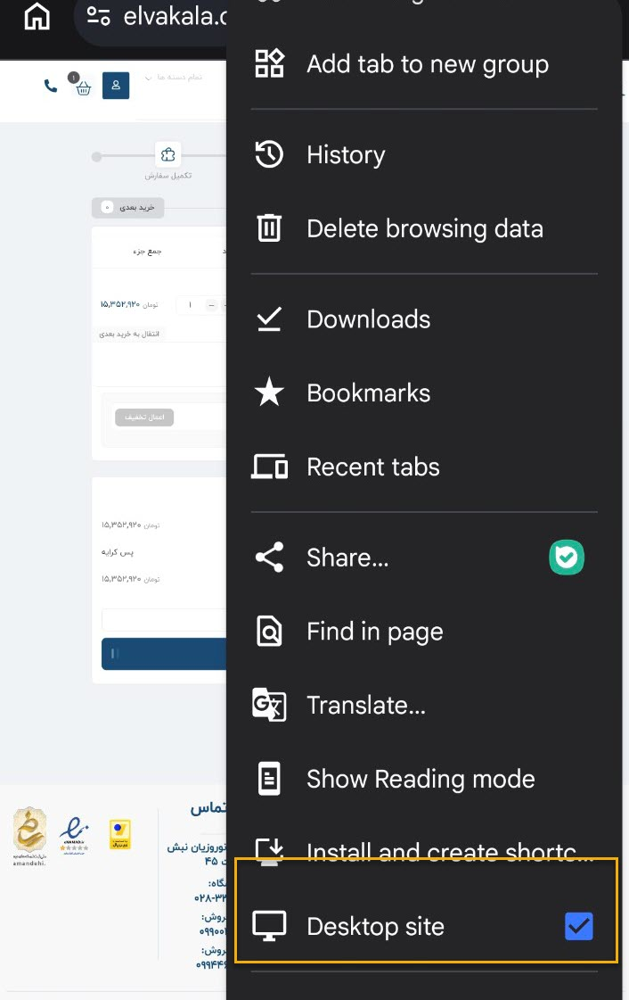
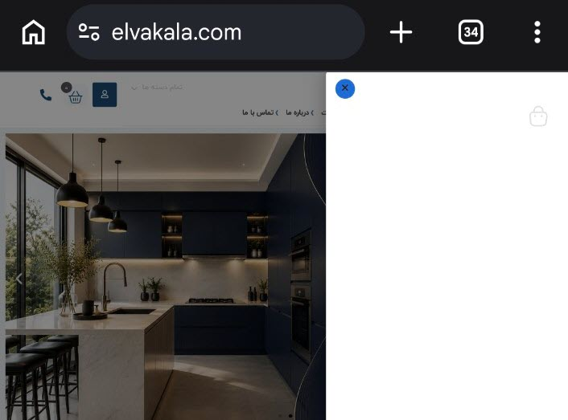
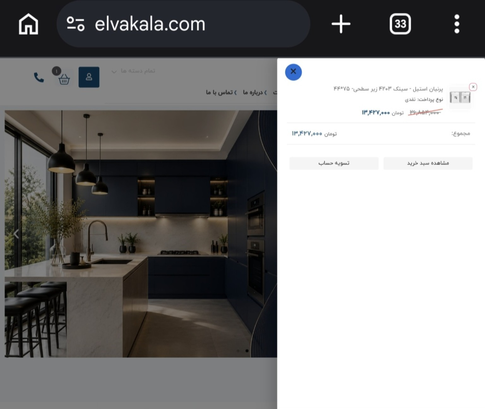

# ELVAKALA Cart Sidebar Repair

A production fix for the ELVAKALA Elementor cart widget that converts the default hover-based mini-cart dropdown into a click-to-open off-canvas sidebar.

## Problem

The Elementor header cart widget rendered the WooCommerce mini-cart as a hover dropdown.

This caused several usability problems:

* The dropdown opened unintentionally on hover.
* Part of the dropdown could appear outside the viewport.
* Clicking the cart icon redirected the user directly to `/cart/`.
* The expected right-side cart panel was missing.
* After WooCommerce AJAX fragment updates, direct click handlers could be lost.

The widget already included the following sidebar trigger attributes:

```html
class="shop_cart get_sidebar"
data-class="open_cart_sidebar"
```

However, the required `.cart_sidebar` element was not rendered on the page. Therefore, the theme’s original sidebar-opening JavaScript could not complete the action.

## Solution

The snippet reuses the existing WooCommerce mini-cart markup instead of creating a separate cart implementation.

It converts the existing `.shop_detail` element into a responsive right-side off-canvas panel and adds:

* Click-to-open cart behavior
* Right-side slide-in animation
* Background overlay
* Background scroll locking
* Close button
* Close on overlay click
* Close with the Escape key
* Responsive sizing
* Delegated click handling
* Compatibility with WooCommerce AJAX cart-fragment updates

WooCommerce remains responsible for rendering and updating the actual mini-cart contents.

## Files

```text
cart-sidebar-repair.php
README.md
screenshots/
```

## Elementor Dependency

The snippet currently targets this Elementor widget:

```text
.elementor-element-2646698
```

This is the element ID of the ELVAKALA desktop header cart widget.

If the header template is rebuilt, duplicated, or the widget ID changes, update the selector in both the CSS and JavaScript sections of the snippet.

## Installation

1. Open WordPress Admin.

2. Go to **WPCode → Add Snippet**.

3. Create a new **PHP Snippet**.

4. Name it:

   ```text
   ELVA - Header Cart Sidebar Repair
   ```

5. Paste the contents of `cart-sidebar-repair.php`.

6. Set the insertion method to **Run Everywhere**.

7. Save and activate the snippet.

8. Clear all WordPress, server, and browser caches.

9. Test the cart in a private browser window.

Do not include an additional `<?php` opening tag when pasting the code into WPCode.

## AJAX Compatibility

WooCommerce may replace the cart trigger after a product is added or removed.

A listener attached directly to the original `.head_cart_total` element would be lost after this replacement. The final implementation therefore uses delegated click handling:

```javascript
document.addEventListener('click', openCart, true);
```

The current cart trigger is resolved for every click using:

```javascript
event.target.closest(
    '.elementor-element-2646698 .head_cart_total'
);
```

This keeps the sidebar functional after WooCommerce AJAX fragment updates.

## Validation

The following scenarios were tested successfully:

* Empty cart opens in the sidebar
* Filled cart opens in the sidebar
* Cart icon does not redirect directly to `/cart/`
* Product information and totals are displayed
* Product removal works
* Cart counter changes from filled to empty
* Sidebar closes using the close button
* Sidebar closes by clicking the overlay
* Sidebar closes with the Escape key
* Background scrolling is disabled while the sidebar is open
* Desktop layout passes
* Narrow desktop layout passes
* Chrome Desktop Site mode on mobile passes
* Cart remains functional after WooCommerce AJAX updates

## Screenshots

### Before the fix

Desktop hover dropdown:

<p align="center">
  
</p>
Narrow desktop hover dropdown:

<p align="center">
  
</p>
Mobile Desktop Site mode redirecting to the cart page:

<p align="center">
  
</p>
### After the fix

Desktop cart sidebar:

<p align="center">
  
</p>

Chrome Desktop Site test mode:

<p align="center">
  
</p>

Empty cart sidebar:

<p align="center">
  
</p>
Filled cart after WooCommerce AJAX replacement:

<p align="center">
  
</p>
## Rollback

To roll back the change:

1. Deactivate the `ELVA - Header Cart Sidebar Repair` snippet in WPCode.
2. Clear the site cache.
3. Reload the page.

No WooCommerce, Elementor, theme, product, cart, or database data is modified by this snippet.

## Status

```text
Production: Active
Desktop: PASS
Responsive layout: PASS
WooCommerce AJAX updates: PASS
Rollback available: Yes
```
