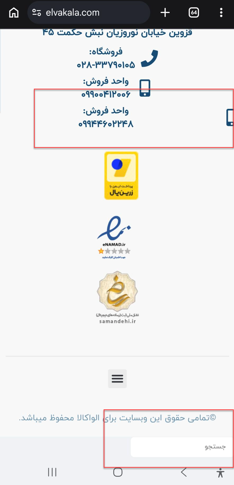
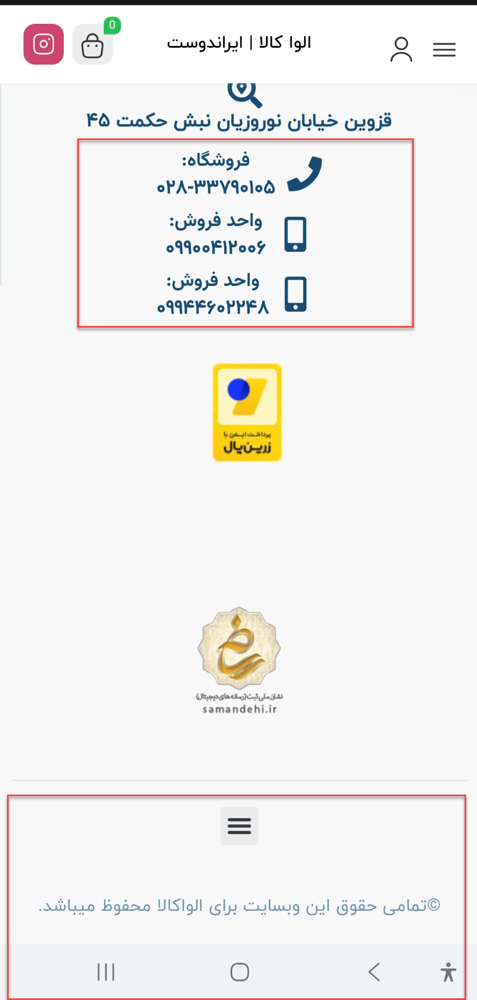

# ELVA KALA — Mobile Homepage Footer Fixes 

Responsive CSS fixes for the ELVA KALA mobile homepage footer.

The customization resolves two mobile-only layout issues:

- An extra search box generated by the Digits plugin appeared below the homepage footer.
- The phone icon for the second sales number was positioned outside the intended content area.

## Files

```text
mobile-homepage-footer-fixes.css
mobile-homepage-footer-before.png
mobile-homepage-footer-after.png
README.md
```

## Implementation

The CSS runs only on screens with a maximum width of `767px`.

### Extra Digits Search Box

The unexpected search element is hidden only on the homepage:

```css
body.home > #digits_country_list_wrapper
```

This prevents the extra Digits search box from appearing below the mobile footer without affecting Digits functionality on other pages.

### Sales Phone Icon Alignment

The Elementor icon box for the second sales phone number is adjusted using scoped selectors.

The fix:

- Centers the widget container
- Keeps the icon and phone information aligned
- Prevents the phone icon from overflowing the mobile viewport
- Preserves the desktop layout

## Before



The extra Digits search box was visible, and the second sales phone icon was incorrectly positioned.

## After


The extra search box is hidden, and the second sales phone icon is correctly aligned.

## Scope

This customization is limited to:

- The ELVA KALA homepage
- Mobile screens up to `767px`
- Elementor page ID `5332`
- Elementor element ID `3a4570f`

Because the icon fix depends on Elementor-generated element IDs, it should be reviewed if the footer template or affected widget is rebuilt.

## Deployment

The stylesheet is currently deployed through the WPCode snippet:

```text
ELVA - Hide Digits Search on Mobile Homepage
```

## Status

Tested successfully on the mobile homepage.

**Status:** Stable
