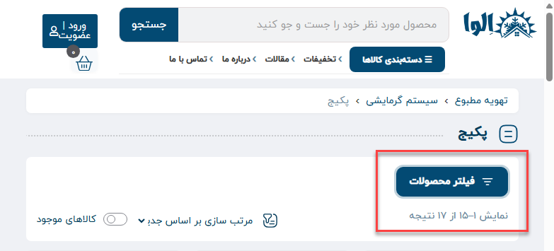
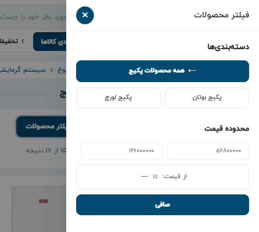
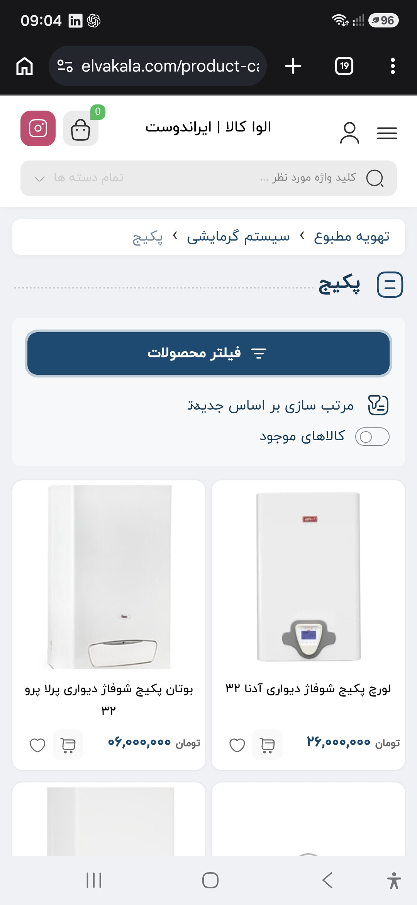
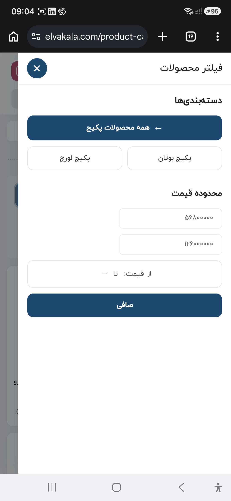
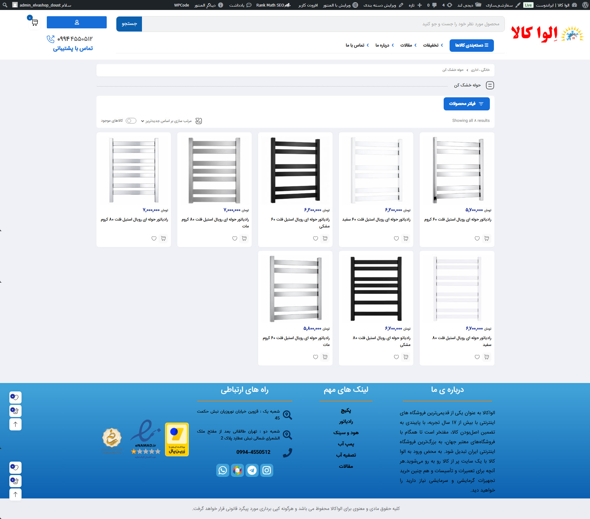
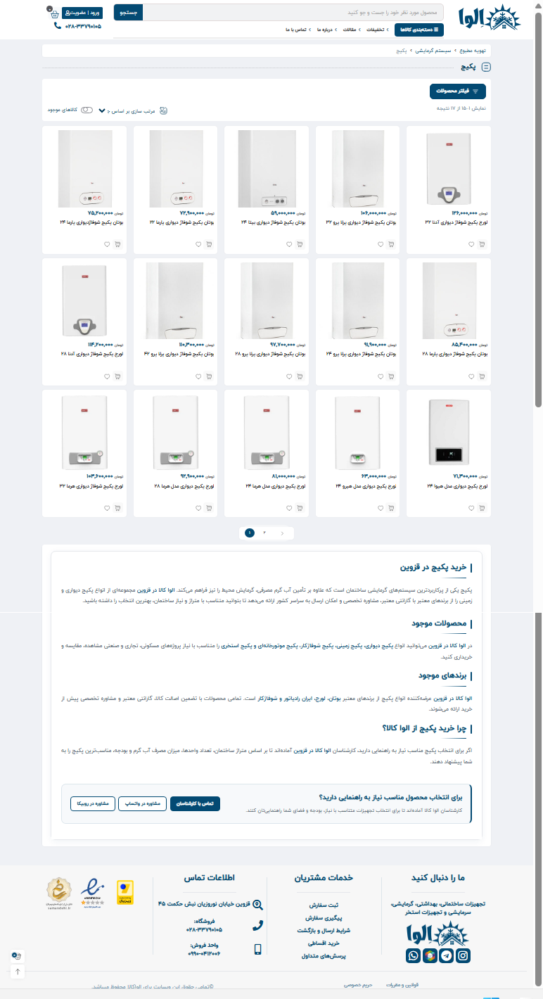
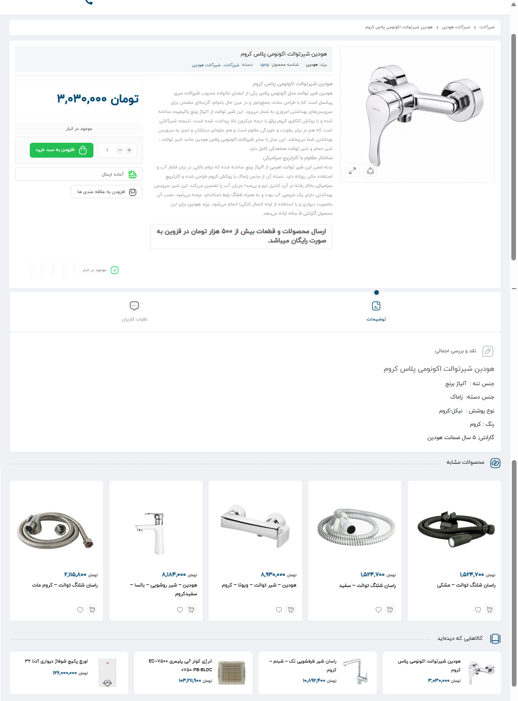
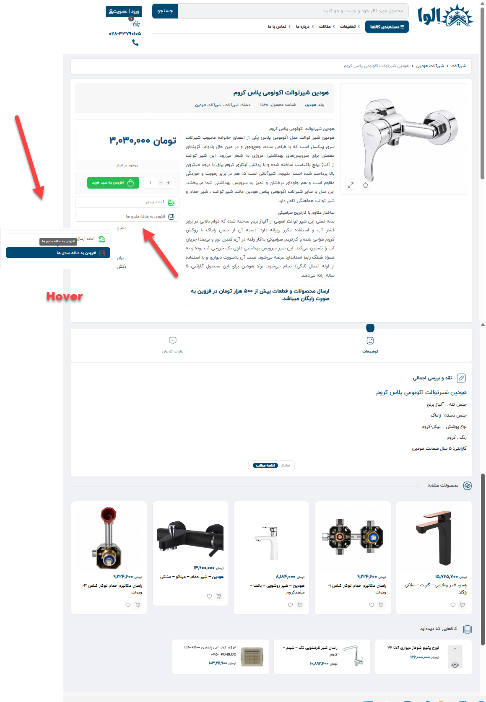
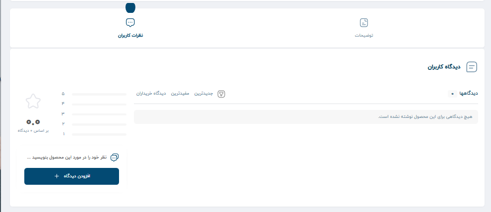

# ELVA KALA — WooCommerce Product UI Customizations

Custom WooCommerce front-end improvements developed for the ELVA KALA online store.

This repository contains three focused customizations for WooCommerce product pages and product archives:

- Product archive filter drawer
- Product category archive styling fixes
- Single product page styling

The customizations were created to improve usability, visual consistency, responsive behavior, and integration with the existing ELVA KALA theme without rebuilding the WooCommerce templates from scratch.

---

## Files

### `product-filter-drawer.php`

Custom product filter drawer for WooCommerce archive pages.

Runs on:

- WooCommerce Shop
- Product Category archives
- Product Taxonomy archives

The drawer is added through WooCommerce and WordPress hooks and includes its own markup, styling, and JavaScript behavior.

### Main features

- Adds a **Product Filter** button above the WooCommerce product loop
- Opens filters inside a slide-in drawer
- Adds a dark overlay behind the drawer
- Prevents background page scrolling while the drawer is open
- Supports closing from the close button and overlay
- Includes keyboard and focus handling for accessibility
- Uses ARIA attributes for drawer state and dialog behavior
- Includes reduced-motion support

### Dynamic category navigation

The category section changes according to the current archive.

When the current product category contains child categories, those child categories are displayed.

When the current category has no children, its parent category and sibling categories are used instead.

On the main shop and other product archive pages, top-level product categories are used.

The current category can also be visually marked as active.

### WooCommerce filters

The drawer uses native WooCommerce widgets where available:

- Active filters
- Price filter
- Layered navigation filters
- WooCommerce product attributes

Attribute filters are generated automatically from registered WooCommerce attributes that contain terms.

This means additional WooCommerce attributes can become available in the drawer without manually creating a separate filter block for each attribute.

### Responsive behavior

The drawer is designed for both desktop and mobile layouts.

On smaller screens:

- The filter button becomes full width
- The drawer uses most of the viewport width
- Internal spacing is reduced
- Category cards remain responsive
- Very narrow screens switch the category grid to a single column

### Screenshots

#### Desktop

#### Mobile

---

## `shop-archive-fix.css`

CSS fixes and visual refinements for WooCommerce product category archives.

The stylesheet is scoped mainly to `.tax-product_cat` so the changes target product-category archive pages rather than applying globally across the site.

### Changes

- Adjusts category description spacing and height
- Restores normal category-description overflow behavior
- Repositions the **More Information** button
- Styles WooCommerce breadcrumbs
- Styles category archive titles
- Refines the shop filter and sorting bar
- Styles sorting text and icons
- Styles WooCommerce product result count
- Adjusts product-card action icon colors
- Adds a red hover state to the wishlist heart
- Applies ELVA KALA's blue UI color palette consistently across archive controls

### Shop Archive — Before

### Shop Archive — After

---

## `single-product.css`

Custom styling for WooCommerce single-product pages.

The stylesheet primarily uses `body.single-product` selectors to keep product-page changes isolated from other areas of the website.

### Product header and summary

Includes styling for:

- Breadcrumbs
- Product title
- Brand, SKU and category metadata
- Short product description
- Separators and spacing
- Custom product note
- Wishlist area

The original theme's product service/info area is also explicitly hidden in the current version.

### Product tabs and content

Includes styling for:

- Product tabs
- Active and hover tab states
- Tab headings
- Product-description typography
- Heading hierarchy
- Custom bullet paragraphs
- Ordered lists
- List markers

### Product specifications

The WooCommerce product attributes/specifications area is restyled with:

- Separate visual treatment for attribute names and values
- Borders and spacing
- ELVA KALA typography and colors
- Responsive table sizing

### Read More

The product description's **Read More** control is explicitly restored and styled so it remains visible in the product content area.

### Customer reviews

The review section includes styling for:

- Review headings
- Empty-review messages
- Rating information
- Review filters
- Review submission button
- Rating percentage bars

### Related products

Related-product cards receive a subtle hover interaction with:

- Border-color change
- Light shadow
- Small upward movement

### Screenshots

### Single Product — Before

### Single Product — After

---

## Design System

The customizations follow the existing ELVA KALA visual identity.

Primary colors used throughout the implementation include:

| Purpose | Color |
| --- | --- |
| Primary blue | `#034A73` |
| Dark blue | `#023A5A` |
| Secondary blue | `#4E7D9A` |
| Muted blue-gray | `#6B8CA3` |
| Light border | `#E5E7EB` |
| Light background | `#F7F7F7` |
| Wishlist hover | `#E53935` |

The existing site typography is inherited rather than introducing a separate font dependency.

---

## Compatibility

These customizations depend on the existing ELVA KALA WordPress/WooCommerce front end and its current HTML structure.

`product-filter-drawer.php` specifically depends on WooCommerce functions, archive hooks, widgets, taxonomies, and product attributes.

The CSS files also contain selectors targeting classes provided by the current theme and WooCommerce markup.

Because of this, the code should not be considered a completely theme-independent WooCommerce plugin.

Major theme or WooCommerce template changes should be tested before deploying the customizations unchanged.

---

## Implementation Notes

The project intentionally modifies the existing WooCommerce/theme interface rather than replacing complete WooCommerce templates.

This keeps the customization relatively focused while preserving the store's existing product data, WooCommerce functionality, and theme structure.

Before changing or removing theme classes used by these files, check the affected selectors and archive/product layouts.

---

## Project

Developed for **ELVA KALA**, an online store for heating, cooling, plumbing and building equipment.

### Technologies

- WordPress
- WooCommerce
- PHP
- CSS
- JavaScript

---

## Version Overview

| Component | Version |
| --- | --- |
| Product Filter Drawer | 4.0 |
| Shop Archive Fix | 2.0 |
| Single Product Styling | 2.0 |
